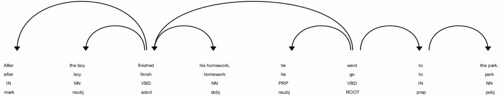

# SpaCy

SpaCy is an open-source natural language processing (NLP) library released under the MIT license. It was created by Explosion AI, a software company founded by Ines Montani and Matthew Honnibal. Ines Montani and Matthew Honnibal are well-known figures in the NLP community. Their goal was to create a fast and efficient NLP library that could be used for various NLP tasks. 

The SpaCy framework is widely used for various text processing and language understanding tasks. In a world where vast amounts of textual information are generated every day, understanding and extracting insights from text has become a critical skill.  SpaCy seeks to simplify the complex task of processing and analyzing text data, enabling developers, data scientists, and researchers to harness the power of language in their applications and projects.

The framework excels at breaking down text into individual words or tokens. Its tokenization process is efficient and language-aware, making it suitable for multiple languages. It also provides part-of-speech tagging capabilities that allow it identify the grammatical parts of speech (e.g., nouns, verbs, adjectives) for each token in a sentence. 

Its ability to recongise named entities (NER) allows a user to classify named entities such as names of people, places, organizations; this is essential for analysis and research in areas like digital humanities, but this feature is also utilized in industries such as healthcare, finance, e-commerce, and social media for tasks like entity recognition in medical records, sentiment analysis of customer reviews, and topic modeling in social media conversations.

A powerful feature of SpaCy is its ability to build dependency trees to represent the grammatical structure of sentences, helping to understand how words relate to each other. This capability allows a user to analyse the grammatical structure of a sentence and use this information to build responsive chat-bots and other automated entities that can communicate using natural language.

Lemmatization is a process that reduces words to their base or dictionary form. This is used in text normalization and preparation for other classification tasks.

SpaCy also seamlessly integrates with machine learning algorithms and models providing a powerful solution for text classification tasks. This type of capability has been very successful in reducing spam on the internet in recent years.

Finally SpaCy provides pre-trained word vectors (word embeddings) that capture semantic information about words, making it easier to work with semantics in text by understanding the relationships between words.

## Glossary

| Term | Meaning |
| ---- | ---- |
| Lemma | In linguistics and natural language processing (NLP), a "lemma" refers to the base or dictionary form of a word. It is the canonical or citation form of a word, from which all its inflected forms (such as different verb conjugations or noun declensions) are derived. |
| Nominal subject | In the context of linguistics and grammar, is a type of subject in a sentence that is realized as a noun or noun phrase. |
| Dependency labels |  Dependency labels in SpaCy represent different types of grammatical relationships and structures within sentences. They are all related to how words and phrases are connected and function in the syntax of a sentence.
## Tokens

A "token" is the smallest unit of text that can be processed and analyzed. Tokens are individual words or characters, or sometimes even subword units, into which a text is divided for various NLP tasks. Tokenization is the process of breaking down a text into these individual tokens.


- Word Tokens: In most NLP applications, tokens are typically words. For example, in the sentence "I love natural language processing," the tokens are "I," "love," "natural," "language," and "processing."
- Character Tokens: In some cases, especially in character-level NLP tasks or for languages without clear word boundaries, tokens can be individual characters. For example, the tokenization of "abc" would result in three character tokens: "a," "b," and "c."
- Subword Tokens: In languages with complex morphology or for machine learning models that operate on subword units, tokenization can be done at the subword level. For example, in English, the word "unhappiness" might be tokenized into "un," "happi," and "ness."
- Whitespace and Punctuation: Tokenization often involves splitting text based on whitespace (spaces, tabs, line breaks) and punctuation marks (e.g., periods, commas, hyphens).
- Tokenization Rules: Tokenization can be language-specific, and the rules for splitting text into tokens may vary based on the language and the specific task.
- Token Objects: In NLP libraries like spaCy, tokens are often represented as objects that include not only the text of the token but also various attributes, such as part-of-speech tags, lemma forms, and more. These attributes are useful for linguistic analysis and other NLP tasks.
- Tokenization Challenges: Tokenization can be challenging for certain languages, especially those with agglutinative or morphologically rich features, as well as for handling contractions, compound words, and other linguistic phenomena.
- Tokenization is a fundamental step in many NLP pipelines, as it serves as the basis for tasks such as part-of-speech tagging, named entity recognition, syntactic parsing, and text classification. Accurate tokenization is crucial for ensuring that NLP models can understand and process text effectively.

## Spans

In spaCy, a "span" refers to a continuous sequence of tokens within a Doc object. A span can represent a portion of the text in a document, which can include one or more adjacent tokens. Spans are often used to extract or manipulate specific segments of text within a larger document.

Key characteristics of spans in spaCy include:

- Continuous Sequence: A span consists of a sequence of tokens that appear consecutively in the text. These tokens are usually adjacent to each other.
- Immutable: Spans are immutable, meaning you cannot modify the text they represent directly. However, you can create new spans based on existing ones.
- Index-Based: Spans can be indexed to access individual tokens within the span.
- Text and Context: A span retains information about the text it represents and its position within the document.

### Example of a Span

In the sentence: "It was really raining heavily when I left home so I took a cab."

"It" is token 0 and "cab" is token 13.

So, when you refer to the span [3:4], we are specifying a span that includes only one token, which is "raining" (token 3). The notation [3:4] represents a span that starts at token 3 (inclusive) and ends just before token 4 (exclusive). In this case, the span [3:4] represents the single token "raining" in the sentence.


## Sentences

A "sentence" is a linguistic unit that represents a complete and independent thought or statement within a text. SpaCy provides tools for sentence segmentation, which is the process of identifying and separating text into individual sentences. Each sentence is composed of one or more tokens (words or subword units) that form a grammatical and semantic unit.

- Sentence Objects: SpaCy represents sentences as individual objects within a Doc object. A Doc object is created by processing a text using a spaCy language model. You can access sentences within a Doc using the sents attribute.
- Sentence Tokenization: SpaCy performs sentence tokenization by identifying sentence boundaries based on punctuation marks (such as periods, exclamation marks, and question marks) and other language-specific rules. It aims to accurately identify where one sentence ends and the next begins.
- Sentence-Level Attributes: You can access various attributes at the sentence level, such as the text of the sentence, the start and end token indices, and the sentence's root token.

## Understand Ancestors and Children

In spaCy, the concepts of "ancestors" and "children" refer to the relationships between tokens in a parsed document. These relationships are part of the syntactic structure of the text and are useful for analyzing and manipulating the text data. 

### Ancestors

Ancestors are tokens that are higher in the syntactic tree of a sentence. They are usually tokens that govern or modify the given child token. Ancestors are often associated with tokens that play roles like verbs, adjectives, or other head words in the sentence.

### Children

Children are tokens that are lower in the syntactic tree. They are tokens that a given token governs or modifies. When we move down the syntactic tree hierarchy, we encounter the children of a token and these can be elements like nouns, adverbs, prepositional phrases, or other syntactic components that depend on the token.

### Example

Consider the sentence:

- The cat sat on the mat.


This has the following structure.


| Text         | Index  | POS      | Dependency      | Dependency Detail               | Ancestors            | Children   |
| ------------ | -------- | ------ | -------- | ------------------- |-------------- | --------- |
| The          | 0      | DET      | det      | determiner               | cat sat              |            |
| cat          | 1      | NOUN     | nsubj    | nominal subject          | sat                  | The        |
| sat          | 2      | VERB     | ROOT     | root                     |                      | cat on .   |
| on           | 3      | ADP      | prep     | prepositional modifier   | sat                  | mat        |
| a            | 4      | DET      | det      | determiner               | mat on sat           |            |
| mat          | 5      | NOUN     | pobj     | object of preposition    | on sat               | a          |
| .            | 6      | PUNCT    | punct    | punctuation              | sat                  |            |


- __'The'__ has ancestors __'cat'__ and __'sat'__, but it has no children as seen on the graph, there is no arrow starting from __'The'__ and travelling to another token.
- __'cat'__ has an ancestor __'sat'__ as seen in the arrow that starts from __'sat'__ and points back to __'cat'__. 'cat' also has a child __'The'__ with the arrow originating at __'cat'__ and pointing back to __'The'__.
- __'sat'__ the ROOT verb has no ancestors, but it does have two children, one on each side.
- Similarly __'sat'__ is an ancestor of __'on'__
- __'mat'__ has ancestors __'on'__ through a direct dependency and sat indirectly via 'on's relationship with ___'sat'__. __'mat'__ also has a child __'a'__.


## Syntax Tree

Syntax trees, also known as parse trees or syntactic trees, are used in linguistics and natural language processing (NLP) for several important purposes:

- Structural Representation: Syntax trees provide a structured representation of the grammatical structure of a sentence. They break down a sentence into its constituent parts (phrases and words) and illustrate how these parts are hierarchically organized. This structural representation is crucial for understanding the syntax of a language.
- Grammatical Analysis: Syntax trees help linguists and NLP practitioners analyze the grammatical relationships between words and phrases in a sentence. They reveal the roles of different words (e.g., subjects, objects, modifiers) and how these roles interact to form grammatical and meaningful sentences.
- Ambiguity Resolution: Natural language often contains ambiguities, where a sentence can have multiple valid interpretations. Syntax trees can help disambiguate sentences by showing different possible parse trees for the same sentence. NLP algorithms can then choose the most contextually appropriate interpretation.
- Language Understanding: Syntax trees play a fundamental role in language understanding tasks. They provide a basis for semantic analysis, which involves extracting meaning from sentences. For example, semantic roles (e.g., agent, patient) can be associated with syntactic constituents in a syntax tree to understand who is doing what to whom in a sentence.
- Dependency Parsing: In dependency parsing, a type of syntactic analysis, syntax trees are used to represent grammatical dependencies between words. This is crucial for understanding how words in a sentence relate to each other and for tasks like information extraction and machine translation.
- Machine Learning and NLP: In natural language processing, syntax trees are often used as input features for machine learning models. Machine learning algorithms can learn patterns and relationships from syntax trees to perform various NLP tasks, such as part-of-speech tagging, named entity recognition, and sentiment analysis.

### Representing a sentence as a Syntax Tree

### NLTK Tags

| POS Tag | Description                    |
|---------|--------------------------------|
| S       | Main Sentence                  |
| PP      | Prepositional Phrase            |
| IN      | Preposition                    |
| NP      | Noun Phrase                    |
| PRP     | Personal Pronoun               |
| PRP$    | Possessive Pronoun (e.g., "my") |
| NN      | Singular Noun                  |
| NNS     | Plural Noun                    |
| NNP     | Proper Noun (Singular)         |
| NNPS    | Proper Noun (Plural)           |
| DT      | Determiner                     |
| VB      | Verb (Base Form)               |
| VBD     | Verb (Past Tense)              |
| VBG     | Verb (Gerund/Participle)       |
| VBN     | Verb (Past Participle)         |
| VBP     | Verb (Non-3rd Person Singular Present) |
| VBZ     | Verb (3rd Person Singular Present)     |
| RB      | Adverb                         |
| RBR     | Adverb (Comparative)           |
| RBS     | Adverb (Superlative)           |
| JJ      | Adjective                      |
| JJR     | Adjective (Comparative)        |
| JJS     | Adjective (Superlative)        |
| CC      | Coordinating Conjunction       |
| CD      | Cardinal Number                |
| UH      | Interjection                   |
| EX      | Existential There              |
| FW      | Foreign Word                   |
| LS      | List Item Marker               |
| MD      | Modal                          |
| PDT     | Predeterminer                  |
| POS     | Possessive Ending              |
| RP      | Particle                       |
| SYM     | Symbol                         |
| TO      | to (Infinitive Marker)         |
| WDT     | Wh-Determiner                  |
| WP      | Wh-Pronoun                     |
| WP$     | Possessive Wh-Pronoun (e.g., "whose") |
| WRB     | Wh-Adverb                      |


These abbreviations and their explanations are commonly used in syntactic analysis and tree representations to describe the structure of sentences and phrases in natural language. For example:

SpaCy uses different POS Tags, the following table shows a comparison:

| POS Tag (spaCy) | Description           | POS Tag (NLTK) | Description             |
|------------------|-----------------------|----------------|-------------------------|
| ADJ              | Adjective             | JJ             | Adjective               |
| ADP              | Adposition (Preposition) | IN          | Preposition             |
| ADV              | Adverb                | RB             | Adverb                  |
| AUX              | Auxiliary verb        | MD             | Modal verb              |
| CCONJ            | Coordinating conjunction | CC          | Coordinating conjunction |
| DET              | Determiner            | DT             | Determiner              |
| INTJ             | Interjection          | UH             | Interjection            |
| NOUN             | Noun                  | NN             | Singular noun           |
| NUM              | Numeral               | CD             | Cardinal number         |
| PART             | Particle              | RP             | Particle                |
| PRON             | Pronoun               | PRP            | Personal pronoun        |
| PROPN            | Proper noun           | NNP            | Proper noun             |
| PUNCT            | Punctuation           | .              | Punctuation             |
| SCONJ            | Subordinating conjunction | IN        | Subordinating conjunction|
| SYM              | Symbol                | SYM            | Symbol                  |
| VERB             | Verb                  | VB             | Verb (base form)        |
| X                | Other                 | -              | -                       |

Please note that this is not an exhaustive list, and both libraries may have additional tags for more specialized linguistic categories.

```
[S  [NP [DT The] [NN cat]]
  [VP    [VBD sat]
    [PP      [IN on]
      [NP [DT the] [NN mat]]
    ]
  ]
]
```


### Children and Ancestors

__Child__: A "child" token is a token that directly depends on or is governed by another token. In a dependency parse tree, it represents a word or phrase that is syntactically subordinate to and dependent on its parent token.

__Ancestor__: An "ancestor" token is a token that governs or controls another token in the parse tree. It is a token higher up in the tree hierarchy that has one or more tokens depending on it, either directly or indirectly.

## Extracting Clauses from a Sentence

Due to the richness and variety of the English language extracting clauses from a sentence can be a complex process. The process can be accomplished in a number of discrete steps.

In this exercise we will use the following target sentence:

```txt
After the boy finished his homework, he went to the park.
```


In this sentence, there are two clauses:

"After the boy finished his homework" is a dependent (subordinate) clause because it cannot stand alone as a complete sentence. It provides additional information about the timing or condition for the action in the independent clause.

"He went to the park" is an independent clause because it can stand alone as a complete sentence and expresses a complete thought.

| Text         | Index  | POS      | Dependency      | Dependency Detail               | Ancestors            | Children   |
| ------ | ------ | ---- | ------- | ------- | --------- |  ------- |
| After        | 0      | SCONJ    | mark     | marker                   | finished went        |            |
| the          | 1      | DET      | det      | determiner               | boy finished went    |            |
| boy          | 2      | NOUN     | nsubj    | nominal subject          | finished went        | the        |
| finished     | 3      | VERB     | advcl    | adverbial clause modifier | went                 | After boy homework |
| his          | 4      | PRON     | poss     | possession modifier      | homework finished went |            |
| homework     | 5      | NOUN     | dobj     | direct object            | finished went        | his        |
| ,            | 6      | PUNCT    | punct    | punctuation              | went                 |            |
| he           | 7      | PRON     | nsubj    | nominal subject          | went                 |            |
| went         | 8      | VERB     | ROOT     | root                     |                      | finished , he to . |
| to           | 9      | ADP      | prep     | prepositional modifier   | went                 | park       |
| the          | 10     | DET      | det      | determiner               | park to went         |            |
| park         | 11     | NOUN     | pobj     | object of preposition    | to went              | the        |
| .            | 12     | PUNCT    | punct    | punctuation              | went                 |            |


We can look at the dependency chart for the example sentence.




- The first line in the diagram shows the text.
- The second line shows the lemma or base form of the word.
- The third line shows the part of speech.
- The fourth line shows the dependency identifier associated with that word.


We can also view this sentence as a Syntax Tree

```txt
[S 
    [PP
        [P [IN After]][NP [DT the][NN boy]]
    ]
    [VP 
        [V [VBD finished]][NP [PRP$ his][NN homework]]
    ]
    [, ,]
    [PRP he]
    [VP 
        [V [VBD went]][PP [TO to][NP [DT the][NN park]]]
    ]
    [. .]
]
```


You can generate Syntax Trees [here](https://dprebyl.github.io/syntree/#).

## Finding the Verbs in the Sentence

The first step in identifying clauses is to find the verbs or verb phrases (including any auxiliary verbs) in the sentence. SpaCy's dependency analysis allows us identify verbs through its part of speech tagging (pos). 

| POS   | Description                                     | Example              |
|-----------|-------------------------------------------------|----------------------|
| VERB      | Main verb in base form                         | "run," "jump"        |
| AUX       | Auxiliary verb or helping verb                 | "is," "have," "will" |


The POS VERB can have a number of associated Tags

| Tags for VERB | Description                                     | Example              |
|-----------|-------------------------------------------------|----------------------|
| VB        | Verb in base form (general verb tag)           |             "fix", "join", "see"         |
| VBD       | Verb in the past tense                         | "ate," "ran," "jumped" |
| VBG       | Verb in gerund or present participle form     | "eating," "running," "jumping" |
| VBN       | Verb in past participle form                   | "eaten," "taken," "written" |
| VBP       | Verb in non-3rd person singular present tense | "eat" in "I eat"     |
| VBZ       | Verb in 3rd person singular present tense     | "eats" in "He eats"  |

The POS AUX can have a number of associated Tags

| Tags for AUX | Description                                     | Example              |
|-----------|-------------------------------------------------|----------------------|
| VB        | Verb in base form (general verb tag)           |       "be"           |
| AUXPASS   | Auxiliary verb in passive voice                | "was," "were"         |
| MD        | Modal verb                                      |  "can," "could," "may," "might," "shall," "should," "will," "would," "must,"  |
| VBD       | Verb in the past tense                         | "was," "were," "been" ,"did" ,"had"|
| VBG       | Verb in gerund or present participle form     | "are dancing" |
| VBN       | Verb in past participle form                   | "had eaten," "was taken," "had written" |
| VBP       | Verb in non-3rd person singular present tense | "are"     |
| VBZ       | Verb in 3rd person singular present tense     | "is", "has"  |


Using these POS and Tags we can create a SpaCy [matcher](https://spacy.io/api/matcher) which will identify the verb and verb phrases in a sentence.


```python
    verb_matcher.add("Auxiliary verb phrase aux-adv-verb", [
        [{"POS": "AUX"}, {"POS": "ADV", "OP": "+"}, {"POS": "VERB"}]])
    verb_matcher.add("Auxiliary verb phrase aux-verb", [
        [{"POS": "AUX"}, {"POS": "VERB"}]])
    verb_matcher.add("Auxiliary verb phrase", [[{"POS": "AUX"}]])
    verb_matcher.add("Verb phrase", [[{"POS": "VERB"}]],)

```

The first of these rules:

```python
[[{"POS": "AUX"}, {"POS": "ADV", "OP": "+"}, {"POS": "VERB"}]]
```

Matches the following: 

```txt
An auxiliary verb (POS: "AUX").
One or more adverbs (POS: "ADV") with the "+" operator (indicating one or more).
A main verb (POS: "VERB").
```

```txt
Example: "has always been studying"
```

The rule:

```python
[[{"POS": "AUX"}, {"POS": "VERB"}]]
```

Matches the following: 

```txt
An auxiliary verb phrase that includes:
An auxiliary verb (POS: "AUX").
A main verb (POS: "VERB").
```

```txt
Example: "is running"
```

```python
[[{"POS": "AUX"}]]
```

```txt
This pattern is simply matching an auxiliary verb phrase containing only:
An auxiliary verb (POS: "AUX").
```


```txt
Example: "have" 
```


The final pattern

```python
[[{"POS": "VERB"}]]
```


```txt
This pattern is identifying a verb phrase consisting of:
A main verb (POS: "VERB").
```

```txt
Example: "runs"
```

Some sample code is provided for finding the verbs and auxilary verbs for this sentence. I have used a specific version of the more generalised code which can be found [here](./finding_verbs.md) for these examples.


Analysing our sample sentence we get:


| Sentence                                           | Verb Parts           |
| -------------------------------------------------- | -------------------- |
| After the boy finished his homework, he went to the park. | finished |
| ... | went |

In this simple sentence the rule:

```python
[[{"POS": "VERB"}]]
```
matches both verbs.

### Find the Subject of a Verb

The second stage in finding the clauses in a sentence is to find the subjects of the verbs we found in the previous step.


To find the subjects of a verb we must first find its children. We can initially search for nominal subjects (nsubj) and passive nominal subjects (nsubjpass).

#### Nominal Subjects

A nominal subject, in the context of linguistics and grammar, is a type of subject in a sentence that is realized as a noun or noun phrase. The nominal subject typically performs the action described by the verb or is the entity about which something is stated. It answers the question "Who or what is performing the action? In English, it usually appears before the verb in a declarative sentence; however, in the passive voice it may not appear before the verb.

__Examples__:

- __John__ Sings.
- __He__ likes apples.
- __The chef__ cooks the meal. (active voice)


#### Passive Nominal Subject (Passive Voice):

In a passive voice sentence, the passive nominal subject is the entity that undergoes the action described by the passive verb. It represents the entity upon which the action is performed and is often located at the beginning of the sentence. The passive voice emphasizes the action or the result of the action, rather than the doer of the action.

__Examples__:

- __The cake__ (passive nominal subject) was eaten (passive verb) by the children.
- __The car__ (passive nominal subject) was damaged (passive verb) in the accident.
- __The meal__ (passive nominal subject) is cooked (passive verb) by the chef (agent).


If the verb has no children, or if its children do not have dependencies of type nsubj and nsubjpass, then we must move up the tree and continue our search. 
The code for a general approach to finding verbs using Python and SpaCy is provided [here](./finding_subjects.py)


For our example sentence we get the following:

```txt
Finding the subjects for the sentence: After the boy finished his homework, he went to the park.
Finding the subjects for the verb: finished
The verb phrase that contains [finished] has a child dependency [nsubj] that points to a Nominal Subject: [the boy].
Verb: finished  Subject: the boy
Finding the subjects for the verb: went
The verb phrase that contains [went] has a child dependency [nsubj] that points to a Nominal Subject: [he].
Verb: went  Subject: he
```

| Subject | Verb |
| ------ | ----- |
|   the boy       |   finished         |
|   he       |   went        |


We can see this diagrammatically by looking at the dependency diagram and following the dependency arrows (shown in red) from the verbs (shown in blue) to the subjects (shown in green)


#### A More Complex Example

Not all sentences will be so straightforward of course. Depending on the sentence structure we may have to recurse further up the dependency tree.

Consider the sentence:

```txt
The cake, which was baked by my sister, was delicious.
```


| Text         | Index  | POS      | Dependency      | Dependency Detail               | Ancestors            | Children   |
| ------ | ------ | ---- | ------- | ------- | --------- |  ------- |
| The          | 0      | DET      | det      | determiner               | cake was             |            |
| cake         | 1      | NOUN     | nsubj    | nominal subject          | was                  | The , baked , |
| ,            | 2      | PUNCT    | punct    | punctuation              | cake was             |            |
| which        | 3      | PRON     | nsubjpass | nominal subject (passive) | baked cake was       |            |
| was          | 4      | AUX      | auxpass  | auxiliary (passive)      | baked cake was       |            |
| baked        | 5      | VERB     | relcl    | relative clause modifier | cake was             | which was by |
| by           | 6      | ADP      | agent    | agent                    | baked cake was       | sister     |
| my           | 7      | PRON     | poss     | possession modifier      | sister by baked cake was |            |
| sister       | 8      | NOUN     | pobj     | object of preposition    | by baked cake was    | my         |
| ,            | 9      | PUNCT    | punct    | punctuation              | cake was             |            |
| was          | 10     | AUX      | ROOT     | root                     |                      | cake delicious . |
| delicious    | 11     | ADJ      | acomp    | adjectival complement    | was                  |            |
| .            | 12     | PUNCT    | punct    | punctuation              | was                  |            |


To find the subjects in this sentence we must first find the verbs or verb phrases (shown below in bold)

The cake, which __"was baked"__ by my sister, __"was"__ delicious.

__Finding the subjects__

- If we examine the dependency graph we find that __"baked"__ has a dependency on __"which"__, which is a nominal subject in passive form.
- The presence of a nominal subject in passive form (nsubjpass) typically indicates the presence of a passive construction; it signifies that the noun or pronoun attached to nsubjpass element is the subject of a passive verb.
- To find this subject we recurse up the tree and examine the words with a relationship to __"which"__. 
- We see that __"which"__ has ancestors __"baked","cake"__ and "__was__".
- We now examine these to see if any of those is a nominal subject. In this case we find that __"cake"__ is a nominal subject and has a child __"baked"__ so we conclude that the subject of the verb phrase __"was baked"__ is __"cake"__.
- Finally we can add the determiner __"The"__ to get the noun phrase shown below:

```txt
The cake was baked.
```


We can also use this process to derive:

```txt
The cake was delicious.
```


## Identifying Clauses

| Dependency  | Description                                              |
|-------------|----------------------------------------------------------|
| "conj"      | Indicates coordination, connecting words, phrases, or clauses of the same grammatical type. |
| "cc"        | Identifies coordinating conjunctions connecting elements of equal grammatical importance. |
| "advcl"     | Represents adverbial clauses that modify verbs, providing additional information about the action's circumstances. |
| "acl"       | Denotes adjectival clauses that modify nouns, describing the qualities or characteristics of the nouns. |
| "ccomp"     | Identifies clauses serving as complements of verbs, functioning as direct objects of verbs when clauses. |


## Entending SpaCy

- [Entending SpaCy through Custom Factories and Components](https://github.com/johnosbb/NLP/blob/main/Spacy/NER/custom_factory_example/ExtendingSpacy.md)
- [Training SpaCy 3.0 for Entity Recognition](https://github.com/johnosbb/NLP/blob/main/Spacy/NER/ner_model_training.md)

## References

- [Extracting verbs using SpaCy](https://stackoverflow.com/questions/47856247/extract-verb-phrases-using-spacy)
- [Stanford typed dependencies manual](https://downloads.cs.stanford.edu/nlp/software/dependencies_manual.pdf)
- [Python For Humanities](https://spacy.pythonhumanities.com)
- https://spacy.pythonhumanities.com/01_04_pipelines.html
- https://www.youtube.com/watch?v=dIUTsFT2MeQ&t=3382s
- [ClausIE: Clause-Based Open Information Extraction](https://resources.mpi-inf.mpg.de/d5/clausie/clausie-www13.pdf)
- [spacy-clausie](https://github.com/mmxgn/spacy-clausie)
- [ClauseIE Test Portal](https://gate.d5.mpi-inf.mpg.de/ClausIEGate/ClausIEGate/)
- [ClausIE page at Max Planck Institute](https://www.mpi-inf.mpg.de/departments/databases-and-information-systems/research/ambiverse-nlu/clausie)
- [Bracketed Notation](https://www.ling.upenn.edu/courses/Spring_2001/ling150/box-bracketing.html#:~:text=In%20a%20tree%20diagram%2C%20the,label%20of%20the%20dominating%20node.)
- [Spacy Tags](https://www.kaggle.com/code/weka511/list-spacy-tags)
