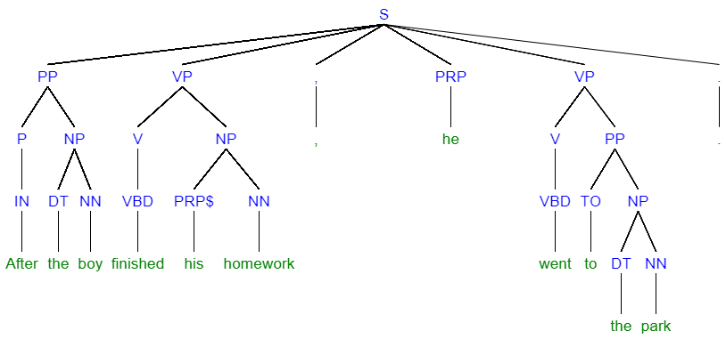
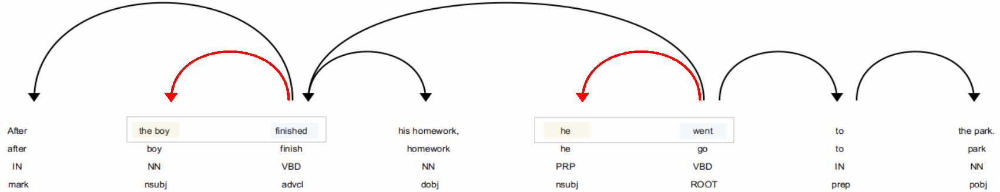

# SpaCy

SpaCy is an open-source natural language processing (NLP) library released under the MIT license. It was created by Explosion AI, a software company founded by Ines Montani and Matthew Honnibal. Ines Montani and Matthew Honnibal are well-known figures in the NLP community. Their goal was to create a fast and efficient NLP library that could be used for various NLP tasks.

The SpaCy framework is widely used for various text processing and language understanding tasks. In a world where vast amounts of textual information are generated every day, understanding and extracting insights from text has become a critical skill.  SpaCy seeks to simplify the complex task of processing and analyzing text data, enabling developers, data scientists, and researchers to harness the power of language in their applications and projects.

The framework excels at breaking down text into individual words or tokens. Its tokenization process is efficient and language-aware, making it suitable for multiple languages. It also provides part-of-speech tagging capabilities that allow it identify the grammatical parts of speech (e.g., nouns, verbs, adjectives) for each token in a sentence. 

Its ability to recongise named entities (NER) allows a user to classify named entities such as names of people, places, organizations; this is essential for analysis and research in areas like digital humanities, but this feature is also utilized in industries such as healthcare, finance, e-commerce, and social media for tasks like entity recognition in medical records, sentiment analysis of customer reviews, and topic modeling in social media conversations.

A powerful feature of SpaCy is its ability to build dependency trees to represent the grammatical structure of sentences, helping to understand how words relate to each other. This capability allows a user to analyse the grammatical structure of a sentence and use this information to build responsive chat-bots and other automated entities that can communicate using natural language.

Lemmatization is a process that reduces words to their base or dictionary form. This is used in text normalization and preparation for other classification tasks.

SpaCy also seamlessly integrates with machine learning algorithms and models providing a powerful solution for text classification tasks. This type of capability has been very successful in reducing spam on the internet in recent years.

Finally SpaCy provides pre-trained word vectors (word embeddings) that capture semantic information about words, making it easier to work with semantics in text by understanding the relationships between words.


<!-- @import "[- [SpaCy](#spacy)
  - [Glossary](#glossary)
  - [Tokens](#tokens)
  - [Spans](#spans)
    - [Example of a Span](#example-of-a-span)
  - [Sentences](#sentences)
  - [Understand Ancestors and Children](#understand-ancestors-and-children)
    - [Ancestors](#ancestors)
    - [Children](#children)
    - [Example](#example)
  - [Syntax Tree](#syntax-tree)
    - [Representing a sentence as a Syntax Tree](#representing-a-sentence-as-a-syntax-tree)
    - [NLTK Tags](#nltk-tags)
    - [Children and Ancestors](#children-and-ancestors)
  - [Clauses](#clauses)
    - [Clause Forms](#clause-forms)
  - [Extracting Clauses from a Sentence](#extracting-clauses-from-a-sentence)
  - [Clause Types](#clause-types)
    - [Wh-Clauses](#wh-clauses)
    - [Th-Clauses](#th-clauses)
    - [Infinitive-Clauses](#infinitive-clauses)
    - [Ing-Clauses](#ing-clauses)
    - [Spacy Clause Dependencies](#spacy-clause-dependencies)
  - [Finding the Verbs in the Sentence](#finding-the-verbs-in-the-sentence)
    - [Find the Subject of a Verb](#find-the-subject-of-a-verb)
      - [SpaCy Subject Dependencies](#spacy-subject-dependencies)
      - [Nominal Subjects](#nominal-subjects)
      - [Passive Nominal Subject (Passive Voice):](#passive-nominal-subject-passive-voice)
      - [A More Complex Example](#a-more-complex-example)
    - [Finding the Objects of a Sentence](#finding-the-objects-of-a-sentence)
      - [Direct Object](#direct-object)
      - [Indirect Object](#indirect-object)
  - [Identifying Complements](#identifying-complements)
    - [Subject Complements](#subject-complements)
    - [Object Complement](#object-complement)
    - [Adjective Complement](#adjective-complement)
  - [Identifying Conjunctions](#identifying-conjunctions)
    - [Grammatical Classifications](#grammatical-classifications)
    - [SpaCy Dependencies for conjunctions](#spacy-dependencies-for-conjunctions)
    - [Conjuncts in Spacy](#conjuncts-in-spacy)
  - [Propositions](#propositions)
  - [Additional Sentence Examples](#additional-sentence-examples)
  - [Entending SpaCy](#entending-spacy)
  - [References](#references)
TOC]" {cmd="toc" depthFrom=1 depthTo=6 orderedList=false} -->

<!-- code_chunk_output -->

- [SpaCy](#spacy)
  - [Glossary](#glossary)
  - [Tokens](#tokens)
  - [Spans](#spans)
    - [Example of a Span](#example-of-a-span)
  - [Sentences](#sentences)
  - [Understand Ancestors and Children](#understand-ancestors-and-children)
    - [Ancestors](#ancestors)
    - [Children](#children)
    - [Example](#example)
  - [Syntax Tree](#syntax-tree)
    - [Representing a sentence as a Syntax Tree](#representing-a-sentence-as-a-syntax-tree)
    - [NLTK Tags](#nltk-tags)
    - [Children and Ancestors](#children-and-ancestors)
  - [Clauses](#clauses)
    - [Clause Forms](#clause-forms)
  - [Extracting Clauses from a Sentence](#extracting-clauses-from-a-sentence)
  - [Clause Structures and Types](#clause-structures-and-types)
    - [Wh-Clauses](#wh-clauses)
    - [Th-Clauses](#th-clauses)
    - [Noun Clauses](#noun-clauses)
    - [Infinitive-Clauses](#infinitive-clauses)
    - [Ing-Clauses](#ing-clauses)
    - [Causal Clauses](#causal-clauses)
    - [Concessive Clauses](#concessive-clauses)
    - [Conditional Clauses](#conditional-clauses)
    - [Relative Clauses](#relative-clauses)
    - [Adverbial Clauses](#adverbial-clauses)
    - [Spacy Clause Dependencies](#spacy-clause-dependencies)
  - [Finding the Verbs in the Sentence](#finding-the-verbs-in-the-sentence)
    - [Find the Subject of a Verb](#find-the-subject-of-a-verb)
      - [SpaCy Subject Dependencies](#spacy-subject-dependencies)
      - [Nominal Subjects](#nominal-subjects)
      - [Passive Nominal Subject (Passive Voice):](#passive-nominal-subject-passive-voice)
      - [A More Complex Example](#a-more-complex-example)
  - [Finding the Objects of a Sentence](#finding-the-objects-of-a-sentence)
    - [Direct Object](#direct-object)
    - [Indirect Object](#indirect-object)
  - [Identifying Adverbials](#identifying-adverbials)
    - [Adverb Phrases](#adverb-phrases)
    - [Adverb Clauses](#adverb-clauses)
    - [Single Adverbs](#single-adverbs)
    - [Prep (Preposition)](#prep-preposition)
    - [Advmod (Adverbial Modifier)](#advmod-adverbial-modifier)
    - [Agent](#agent)
  - [Identifying Complements](#identifying-complements)
    - [Subject Complements](#subject-complements)
    - [Object Complement](#object-complement)
    - [Adjective Complement](#adjective-complement)
  - [Identifying Conjunctions](#identifying-conjunctions)
    - [Grammatical Classifications](#grammatical-classifications)
    - [SpaCy Dependencies for conjunctions](#spacy-dependencies-for-conjunctions)
    - [Conjuncts in Spacy](#conjuncts-in-spacy)
  - [Propositions](#propositions)
  - [Summary](#summary)
  - [Overview of the Clause Extraction Process](#overview-of-the-clause-extraction-process)
    - [Analysis](#analysis)
      - [First Verb](#first-verb)
      - [Second Verb](#second-verb)
    - [The first clause:](#the-first-clause)
    - [The second clause:](#the-second-clause)
  - [Additional Sentence Examples](#additional-sentence-examples)
  - [Entending SpaCy](#entending-spacy)
  - [References](#references)

<!-- /code_chunk_output -->


## Glossary

[See Here](./glossary.md)

## Tokens

A "token" is the smallest unit of text that can be processed and analyzed. Tokens are individual words or characters, or sometimes even sub-word units, into which a text is divided for various NLP tasks. Tokenization is the process of breaking down a text into these individual tokens.

- Word Tokens: In most NLP applications, tokens are typically words. For example, in the sentence "I love natural language processing," the tokens are "I," "love," "natural," "language," and "processing."
- Character Tokens: In some cases, especially in character-level NLP tasks or for languages without clear word boundaries, tokens can be individual characters. For example, the tokenization of "abc" would result in three character tokens: "a," "b," and "c."
- Sub-word Tokens: In languages with complex morphology or for machine learning models that operate on sub-word units, tokenization can be done at the sub-word level. For example, in English, the word "unhappiness" might be tokenized into "un," "happi," and "ness."
- Whitespace and Punctuation: Tokenization often involves splitting text based on whitespace (spaces, tabs, line breaks) and punctuation marks (e.g., periods, commas, hyphens).
- Tokenization Rules: Tokenization can be language-specific, and the rules for splitting text into tokens may vary based on the language and the specific task.
- Token Objects: In NLP libraries like spaCy, tokens are often represented as objects that include not only the text of the token but also various attributes, such as part-of-speech tags, lemma forms, and more. These attributes are useful for linguistic analysis and other NLP tasks.
- Tokenization Challenges: Tokenization can be challenging for certain languages, especially those with agglutinative or morphologically rich features, as well as for handling contractions, compound words, and other linguistic phenomena.
- Tokenization is a fundamental step in many NLP pipelines, as it serves as the basis for tasks such as part-of-speech tagging, named entity recognition, syntactic parsing, and text classification. Accurate tokenization is crucial for ensuring that NLP models can understand and process text effectively.
- Transitive Verbs: A transitive verb is a type of verb that requires one or more objects to complete its meaning in a sentence. In other words, a transitive verb is an action verb that acts on something or someone. 
 
## Spans

In spaCy, a "span" refers to a continuous sequence of tokens within a Doc object. A span can represent a portion of the text in a document, which can include one or more adjacent tokens. Spans are often used to extract or manipulate specific segments of text within a larger document.

Key characteristics of spans in spaCy include:

- Continuous Sequence: A span consists of a sequence of tokens that appear consecutively in the text. These tokens are usually adjacent to each other.
- Immutable: Spans are immutable, meaning you cannot modify the text they represent directly. However, you can create new spans based on existing ones.
- Index-Based: Spans can be indexed to access individual tokens within the span.
- Text and Context: A span retains information about the text it represents and its position within the document.

### Example of a Span

In the sentence: "It was really raining heavily when I left home so I took a cab."

"It" is token 0 and "cab" is token 13.

So, when you refer to the span [3:4], we are specifying a span that includes only one token, which is "raining" (token 3). The notation [3:4] represents a span that starts at token 3 (inclusive) and ends just before token 4 (exclusive). In this case, the span [3:4] represents the single token "raining" in the sentence.

## Sentences

A "sentence" is a linguistic unit that represents a complete and independent thought or statement within a text. SpaCy provides tools for sentence segmentation, which is the process of identifying and separating text into individual sentences. Each sentence is composed of one or more tokens (words or sub-word units) that form a grammatical and semantic unit.

- Sentence Objects: SpaCy represents sentences as individual objects within a Doc object. A Doc object is created by processing a text using a spaCy language model. You can access sentences within a Doc using the 'sents' attribute.
- Sentence Tokenization: SpaCy performs sentence tokenization by identifying sentence boundaries based on punctuation marks (such as periods, exclamation marks, and question marks) and other language-specific rules. It aims to accurately identify where one sentence ends and the next begins.
- Sentence-Level Attributes: You can access various attributes at the sentence level, such as the text of the sentence, the start and end token indices, and the sentence's root token.

## Understand Ancestors and Children

In spaCy, the concepts of "ancestors" and "children" refer to the relationships between tokens in a parsed document. These relationships are part of the syntactic structure of the text and are useful for analyzing and manipulating the text data.

### Ancestors

Ancestors are tokens that are higher in the syntactic tree of a sentence. They are usually tokens that govern or modify the given child token. Ancestors are often associated with tokens that play roles like verbs, adjectives, or other head words in the sentence.

### Children

Children are tokens that are lower in the syntactic tree. They are tokens that a given token governs or modifies. When we move down the syntactic tree hierarchy, we encounter the children of a token and these can be elements like nouns, adverbs, prepositional phrases, or other syntactic components that depend on the token.

### Example

Consider the sentence:

- The cat sat on the mat.


This has the following structure.

| Text         | Index  | POS      | Dependency      | Dependency Detail               | Ancestors            | Children   |
| ------------ | -------- | ------ | -------- | ------------------- |-------------- | --------- |
| The          | 0      | DET      | det      | determiner               | cat sat              |            |
| cat          | 1      | NOUN     | nsubj    | nominal subject          | sat                  | The        |
| sat          | 2      | VERB     | ROOT     | root                     |                      | cat on .   |
| on           | 3      | ADP      | prep     | prepositional modifier   | sat                  | mat        |
| a            | 4      | DET      | det      | determiner               | mat on sat           |            |
| mat          | 5      | NOUN     | pobj     | object of preposition    | on sat               | a          |
| .            | 6      | PUNCT    | punct    | punctuation              | sat                  |            |

- __'The'__ has ancestors __'cat'__ and __'sat'__, but it has no children as seen on the graph, there is no arrow starting from __'The'__ and travelling to another token.
- __'cat'__ has an ancestor __'sat'__ as seen in the arrow that starts from __'sat'__ and points back to __'cat'__. 'cat' also has a child __'The'__ with the arrow originating at __'cat'__ and pointing back to __'The'__.
- __'sat'__ the ROOT verb has no ancestors, but it does have two children, one on each side.
- Similarly __'sat'__ is an ancestor of __'on'__
- __'mat'__ has ancestors __'on'__ through a direct dependency and sat indirectly via 'on's relationship with ___'sat'__. __'mat'__ also has a child __'a'__.


## Syntax Tree

Syntax trees, also known as parse trees or syntactic trees, are used in linguistics and natural language processing (NLP) for several important purposes:

- Structural Representation: Syntax trees provide a structured representation of the grammatical structure of a sentence. They break down a sentence into its constituent parts (phrases and words) and illustrate how these parts are hierarchically organized. This structural representation is crucial for understanding the syntax of a language.
- Grammatical Analysis: Syntax trees help linguists and NLP practitioners analyze the grammatical relationships between words and phrases in a sentence. They reveal the roles of different words (e.g., subjects, objects, modifiers) and how these roles interact to form grammatical and meaningful sentences.
- Ambiguity Resolution: Natural language often contains ambiguities, where a sentence can have multiple valid interpretations. Syntax trees can help disambiguate sentences by showing different possible parse trees for the same sentence. NLP algorithms can then choose the most contextually appropriate interpretation.
- Language Understanding: Syntax trees play a fundamental role in language understanding tasks. They provide a basis for semantic analysis, which involves extracting meaning from sentences. For example, semantic roles (e.g., agent, patient) can be associated with syntactic constituents in a syntax tree to understand who is doing what to whom in a sentence.
- Dependency Parsing: In dependency parsing, a type of syntactic analysis, syntax trees are used to represent grammatical dependencies between words. This is crucial for understanding how words in a sentence relate to each other and for tasks like information extraction and machine translation.
- Machine Learning and NLP: In natural language processing, syntax trees are often used as input features for machine learning models. Machine learning algorithms can learn patterns and relationships from syntax trees to perform various NLP tasks, such as part-of-speech tagging, named entity recognition, and sentiment analysis.

### Representing a sentence as a Syntax Tree

### NLTK Tags

| POS Tag | Description                    |
|---------|--------------------------------|
| S       | Main Sentence                  |
| PP      | Prepositional Phrase            |
| IN      | Preposition                    |
| NP      | Noun Phrase                    |
| PRP     | Personal Pronoun               |
| PRP$    | Possessive Pronoun (e.g., "my") |
| NN      | Singular Noun                  |
| NNS     | Plural Noun                    |
| NNP     | Proper Noun (Singular)         |
| NNPS    | Proper Noun (Plural)           |
| DT      | Determiner                     |
| VB      | Verb (Base Form)               |
| VBD     | Verb (Past Tense)              |
| VBG     | Verb (Gerund/Participle)       |
| VBN     | Verb (Past Participle)         |
| VBP     | Verb (Non-3rd Person Singular Present) |
| VBZ     | Verb (3rd Person Singular Present)     |
| RB      | Adverb                         |
| RBR     | Adverb (Comparative)           |
| RBS     | Adverb (Superlative)           |
| JJ      | Adjective                      |
| JJR     | Adjective (Comparative)        |
| JJS     | Adjective (Superlative)        |
| CC      | Coordinating Conjunction       |
| CD      | Cardinal Number                |
| UH      | Interjection                   |
| EX      | Existential There              |
| FW      | Foreign Word                   |
| LS      | List Item Marker               |
| MD      | Modal                          |
| PDT     | Predeterminer                  |
| POS     | Possessive Ending              |
| RP      | Particle                       |
| SYM     | Symbol                         |
| TO      | to (Infinitive Marker)         |
| WDT     | Wh-Determiner                  |
| WP      | Wh-Pronoun                     |
| WP$     | Possessive Wh-Pronoun (e.g., "whose") |
| WRB     | Wh-Adverb                      |

These abbreviations and their explanations are commonly used in syntactic analysis and tree representations to describe the structure of sentences and phrases in natural language. For example:

SpaCy uses different POS Tags, the following table shows a comparison:

| POS Tag (spaCy) | Description           | POS Tag (NLTK) | Description             |
|------------------|-----------------------|----------------|-------------------------|
| ADJ              | Adjective             | JJ             | Adjective               |
| ADP              | Adposition (Preposition) | IN          | Preposition             |
| ADV              | Adverb                | RB             | Adverb                  |
| AUX              | Auxiliary verb        | MD             | Modal verb              |
| CCONJ            | Coordinating conjunction | CC          | Coordinating conjunction |
| DET              | Determiner            | DT             | Determiner              |
| INTJ             | Interjection          | UH             | Interjection            |
| NOUN             | Noun                  | NN             | Singular noun           |
| NUM              | Numeral               | CD             | Cardinal number         |
| PART             | Particle              | RP             | Particle                |
| PRON             | Pronoun               | PRP            | Personal pronoun        |
| PROPN            | Proper noun           | NNP            | Proper noun             |
| PUNCT            | Punctuation           | .              | Punctuation             |
| SCONJ            | Subordinating conjunction | IN        | Subordinating conjunction|
| SYM              | Symbol                | SYM            | Symbol                  |
| VERB             | Verb                  | VB             | Verb (base form)        |
| X                | Other                 | -              | -                       |

Please note that this is not an exhaustive list, and both libraries may have additional tags for more specialized linguistic categories. [see](https://universaldependencies.org/u/pos/)

```
[S  [NP [DT The] [NN cat]]
  [VP    [VBD sat]
    [PP      [IN on]
      [NP [DT the] [NN mat]]
    ]
  ]
]
```


### Children and Ancestors

__Child__: A "child" token is a token that directly depends on or is governed by another token. In a dependency parse tree, it represents a word or phrase that is syntactically subordinate to and dependent on its parent token.

__Ancestor__: An "ancestor" token is a token that governs or controls another token in the parse tree. It is a token higher up in the tree hierarchy that has one or more tokens depending on it, either directly or indirectly.


## Clauses

A clause is a grammatical structure with both a nominal subject and a main verb phrase. If both elements are not present, then it cannot be a clause.
A clause is __not__ a sentence. A sentence can contain one clause, or it can contain many clauses.

### Clause Forms

There are two primary clause forms: independent clauses and dependent clauses. The most common dependent clause forms include subordinate clauses, relative clauses, that-clauses, and interrogative clauses.
Dependent clauses must perform some assisting role (nominal, adverbial, or adjectival) in the context of a sentence.
Independent clauses are a group of words that contains a subject and verb and expresses a complete thought. An independent clause is a sentence.

[Alternative Classification of Clause Types](./clause_types.md)

## Extracting Clauses from a Sentence

Cognitive linguistics explores how language is shaped by human cognition and experience, and how linguistic structures emerge from cognitive processes. This approach provides insights into how languages evolve in a way that is consistent with cognitive principles. It is fascinating how something that seems to have evolved so organically can maintain so many fundamental structures and rules.

Extracting meaningful information from a sentence with a computer program can be a challenging task due to the richness of the English language and the endless variation in structure and style that result from constant linguistic development.

To extract basic information from a sentence often requires us to first break it into clauses. This can be challenging for Natural Language Processing, but tools like SpaCy do provide many useful elements that can assist us in this process. As we will see in this article (and in subsequent articles), the greater difficulty in a rule-based approach is the high degree of variability and irregularity in grammatical structures used in modern languages.

The process can be accomplished in a number of discrete steps. Our analysis should focus only on the clauses, which means first finding the Main Verb Phrases.

In this exercise we will use the following target sentence:

```txt
After the boy finished his homework, he went to the park.
```

In this sentence, there are two clauses:

"After the boy finished his homework" is a dependent (subordinate) clause because it cannot stand alone as a complete sentence. It provides additional information about the timing or condition for the action in the independent clause.

"He went to the park" is an independent clause because it can stand alone as a complete sentence and expresses a complete thought.

| Text         | Index  | POS      | Dependency      | Dependency Detail               | Ancestors            | Children   |
| ------ | ------ | ---- | ------- | ------- | --------- |  ------- |
| After        | 0      | SCONJ    | mark     | marker                   | finished went        |            |
| the          | 1      | DET      | det      | determiner               | boy finished went    |            |
| boy          | 2      | NOUN     | nsubj    | nominal subject          | finished went        | the        |
| finished     | 3      | VERB     | advcl    | adverbial clause modifier | went                 | After boy homework |
| his          | 4      | PRON     | poss     | possession modifier      | homework finished went |            |
| homework     | 5      | NOUN     | dobj     | direct object            | finished went        | his        |
| ,            | 6      | PUNCT    | punct    | punctuation              | went                 |            |
| he           | 7      | PRON     | nsubj    | nominal subject          | went                 |            |
| went         | 8      | VERB     | ROOT     | root                     |                      | finished , he to . |
| to           | 9      | ADP      | prep     | prepositional modifier   | went                 | park       |
| the          | 10     | DET      | det      | determiner               | park to went         |            |
| park         | 11     | NOUN     | pobj     | object of preposition    | to went              | the        |
| .            | 12     | PUNCT    | punct    | punctuation              | went                 |            |

We can look at the dependency chart for the example sentence.


- The first line in the diagram shows the text.
- The second line shows the lemma or base form of the word.
- The third line shows the part of speech.
- The fourth line shows the dependency identifier associated with that word.

We can also view this sentence as a Syntax Tree

```txt
[S 
    [PP
        [P [IN After]][NP [DT the][NN boy]]
    ]
    [VP 
        [V [VBD finished]][NP [PRP$ his][NN homework]]
    ]
    [, ,]
    [PRP he]
    [VP 
        [V [VBD went]][PP [TO to][NP [DT the][NN park]]]
    ]
    [. .]
]
```



You can generate Syntax Trees [here](https://dprebyl.github.io/syntree/#).

## Clause Structures and Types

| Identifier  | Type | Description                                              | Example | Additional Details |
|-------------|------ | ----------------------------------------------------| ------ | ------ |
| SV     | Subject-Verb | clause type represents a simple sentence structure that contains a subject and a verb but does not have a direct object.  | "She sings."  "I left" "I waited for hours" | This type of clause consists of a subject, verb and an __optional__ adverbial. |
| SVA      | Subject-Verb-Adverbial | This type of clause includes a subject, a copular verb, and an __obligatory__ adverbial phrase that provides additional information about the action. | "The reason for this lies __in how our attention seeks out novelty__."  "John sat __up__" | This type of clause includes a subject, verb and an __obligatory adverbial__. |
| SVdO       | Subject-Verb-Direct Object | This type of clause contains a subject, a monotransitive verb, and a direct object. It represents an action performed by the subject on the direct object.  | "She eats an apple." "This will need surgery." "The sun can create skin damage." | This type of clause is often designated as SVO. |
| SVsP        | Subject-Verb-Subject Predicative | This type of clause consists of a subject and a copular (linking) verb, such as "be," "seem," "appear," etc and a subject predicative. It typically doesn't have a direct object. | "She is a doctor." The water is calm."  "The child __is__ happy." "I __am__ tall" "Mary, a nurse for 20 years, __became__ a doctor." "Agoraphobia __is__ a fear of being in situations where escape might be difficult or that help wouldn't be available if things go wrong." "The battle __was__ difficult." | The Subject Predictive may be an adjective, a noun phrase, an adjective phrase, or an ing-clause. It references the subject or provides additional information about the subject. |
| SVpO       | Subject-Verb-Prepositional Object | This type of clause contains a subject, a prepositional verb, and a prepositional object.   | "One study __looked at__ _200 deaths_." "Mothers __care for__ _their babies_." | Many prepositional verbs can be replaced by a single lexical verb. Example "come across" -> "discover" |
| SVdOA      | Subject-Verb-Direct Object-Adverbial | This clause combines a subject, a transitive verb, a direct object, and an obligatory adverbial phrase. | "Imagine you put a glass bowl __on a hot surface__."  "This causes you to squirm without having __touched it__." | This type of clause consists of a subject, a monotransitive verb, a direct object and an __obligatory__ adverbial. |
| SViOdO       | Subject-Verb-Indirect Object-Direct Object| This type of clause includes a subject, a transitive verb, and both a direct object and an indirect object. The direct object answers the question "what?" while the indirect object answers the question "who?" | "She gives __the book__ to __him__." "The school sent __all parents__ an __important email message__." "The school sent __an important email message__ to __all parents__." | There are two main types: 1. subject verb indirect object direct object. 2. subject verb direct object preposition indirect object. The most common prepositions are "to" and "for". This type of clause is often designated as SVOO.|
| SVdOoP      | Subject-Verb-Object-Object Predicative | In this clause, the subject performs an action (verb) on the direct object, and there's a complement in the form of an object predicative that provides additional information about the object. | "She painted the room __blue__." The cat called the mouse __a coward__." "She made John __angry__" "The child found the book __interesting__." "We helped make it __what it is today__. "Most respondents considered it __good or very good__." | The complementing object predicative provides additional information about the object and may be a __noun-phrase__,a __adjective-phrase__ or  (less frequently) a __wh-clause__.  The object predicative is usually directly follows the direct object. |
| SVdOpO      | Subject-Verb-Direct Object-Prepositional Object | In this clause, the subject performs an action (verb) on the direct object, and a prepositional object provides additional information about the prepositional verb. | "She warned the students about misinformation." He asked her for a second chance."  | The clause consists of a subject, a complex transitive verb, or a complex prepositional verb, a direct object and a prepositional object. |
| SVC         | Subject-Verb-complement | This type of clause consists of a subject and a monotransitive ( taking one object) copular (linking) verb, such as "be," "seem," "appear," etc, and a complement clause. It typically doesn't have a direct object. |  "We know __that__ we can escape." "No one one knows __who__ he is." "No one one knows __how__ he escaped." "She was asked __to recite__ the verse." "Eventually the soup starts __boiling__."| The complement clause may be a __that-clause__, a __wh-clause__, an __infinitive clause__ or an __ing-clause__. (__Note__: "how" is included in wh-clauses") |
| SVdOC      | Subject-Verb-Direct Object-Complement | In this clause, the subject performs an action (verb) on the direct object, and there's a complement clause that provides additional information about the direct object. |  "We can see life __evolving__ all around us." "Animals show us __that__ there are many places to make a home." "The mix of colors in beach sand tells us __what__ kind of rocks produced it."| The complement clause may be a __noun-clause__,a __that-clause__, a __wh-clause__, an __infinitive clause__ or an __ing-clause__. |

### Wh-Clauses

A wh-clause is a subordinate clause that introduces a question or clause that modifies the meaning of the main clause. It typically starts with a wh-word, such as "what," "who," "where," "when," "why," or "how." Wh-clauses are used to elicit information or provide additional context to the main clause.

- I wonder __what__ time the movie starts.
- The teacher asked __who__ had finished their homework.
- Can you tell me __where__ the nearest coffee shop is?
- I don't know __when__ the train will arrive.
- The woman asked the man __why__ he was so sad.
- I'm not sure __how__ to solve this equation.

### Th-Clauses

A th-clause is a subordinate clause that introduces a question or clause that modifies the meaning of the main clause. It typically starts with a th-word, such as "that, th-clauses are used to elicit information or provide additional context to the main clause.

- We know __that__ he likes to run..
- I can see __that__ you are upset..


### Noun Clauses

A dependent clause that functions as a noun in a sentence. It can act as a subject, object, or complement.For example, "__What she said__ surprised me." Noun clauses are often introduced by words like :"What, who, whom, whose, which, whoever, whomever, whichever, whatever, how, why"

### Infinitive-Clauses

An infinitive clause is a type of subordinate (dependent) clause that starts with an infinitive verb form, which is the base form of a verb preceded by the word "to." Infinitive clauses can serve various functions within a sentence and often act as nouns, adjectives, or adverbs.

- He knows __to learn__ a new language is very important for his development.
- She decided __to take__ a vacation after a busy month.
- I encouraged my friend __to pursue__ his dreams.
- She woke up early __to catch the first train__.


### Ing-Clauses

An "-ing clause" is a type of clause that starts with a verb ending in "-ing," known as a gerund. A gerund is the -ing form of a verb that functions as a noun in a sentence. These clauses are also referred to as gerund clauses or present participle clauses.

- __Running__ every morning is good for your health.
- She enjoys __dancing at parties__.
- The movie __starring famous actors__ was a blockbuster.

### Causal Clauses

A causal clause, also known as a cause-and-effect clause, expresses the reason or cause behind an action or event. It typically indicates a cause-and-effect relationship between the information in the main clause and the information in the dependent (subordinate) clause. Causal clauses are introduced by subordinating conjunctions that indicate cause or reason, such as "because," "since," "as," or "for." For example, "He couldn't attend the meeting because he was feeling unwell".

### Concessive Clauses

A concessive clause is a subordinate clause which refers to a situation that contrasts with the one described in the main clause. For example, in the sentence '__Although__ he was tired, he couldn't get to sleep', the first clause is a concessive clause. Concession clauses are often introduced with words like: "Although, though, even though, while, whereas, despite, in spite of, regardless of."

### Conditional Clauses

A type of adverbial clause that expresses a condition. It often begins with words like "if," "unless," or "provided that." For example, "__If__ it rains, we will stay indoors." Conditional clauses are often introduced by words like: "If, unless, even if, whether, provided that, in case".

### Relative Clauses

A type of dependent clause that usually begins with a relative pronoun (such as who, whom, whose, which, or that) and provides additional information about a noun in the main clause. For example: "The book __that I borrowed from the library__ was interesting."

### Adverbial Clauses

A dependent clause that functions as an adverb, providing information about the time, place, manner, or condition of the action in the main clause. For example, "__After she finished her homework__, she went to bed." Adverbials are normally introduced by words like: "When, where, while, before, after, since, as, as if, as though, although, because, if, unless, until, so that, in order that, whenever, wherever"

### Spacy Clause Dependencies

| Dependency  | Description                                              |
|-------------|----------------------------------------------------------|
| "advcl"     | Represents adverbial clauses that modify verbs, providing additional information about the action's circumstances. |
| "acl"       | Denotes adjectival clauses that modify nouns, describing the qualities or characteristics of the nouns. |

## Finding the Verbs in the Sentence

The first step in identifying clauses is to find the verbs or verb phrases (including any auxiliary verbs) in the sentence. SpaCy's dependency analysis allows us identify verbs through its part of speech tagging (pos). 

| POS   | Description                                     | Example              |
|-----------|-------------------------------------------------|----------------------|
| VERB      | Main verb in base form                         | "run," "jump"        |
| AUX       | Auxiliary verb or helping verb                 | "is," "have," "will" |

The POS VERB can have a number of associated Tags

| Tags for VERB | Description                                     | Example              |
|-----------|-------------------------------------------------|----------------------|
| VB        | Verb in base form (general verb tag)           |             "fix", "join", "see"         |
| VBD       | Verb in the past tense                         | "ate," "ran," "jumped" |
| VBG       | Verb in gerund or present participle form     | "eating," "running," "jumping" |
| VBN       | Verb in past participle form                   | "eaten," "taken," "written" |
| VBP       | Verb in non-3rd person singular present tense | "eat" in "I eat"     |
| VBZ       | Verb in 3rd person singular present tense     | "eats" in "He eats"  |

The POS AUX can have a number of associated Tags

| Tags for AUX | Description                                     | Example              |
|-----------|-------------------------------------------------|----------------------|
| VB        | Verb in base form (general verb tag)           |       "be"           |
| AUXPASS   | Auxiliary verb in passive voice                | "was," "were"         |
| MD        | Modal verb                                      |  "can," "could," "may," "might," "shall," "should," "will," "would," "must,"  |
| VBD       | Verb in the past tense                         | "was," "were," "been" ,"did" ,"had"|
| VBG       | Verb in gerund or present participle form     | "are dancing" |
| VBN       | Verb in past participle form                   | "had eaten," "was taken," "had written" |
| VBP       | Verb in non-3rd person singular present tense | "are"     |
| VBZ       | Verb in 3rd person singular present tense     | "is", "has"  |

Using these POS and Tags we can create a SpaCy [matcher](https://spacy.io/api/matcher) which will identify the verb and verb phrases in a sentence.

```python
    verb_matcher.add("Auxiliary verb phrase aux-adv-verb", [
        [{"POS": "AUX"}, {"POS": "ADV", "OP": "+"}, {"POS": "VERB"}]])
    verb_matcher.add("Auxiliary verb phrase aux-verb", [
        [{"POS": "AUX"}, {"POS": "VERB"}]])
    verb_matcher.add("Auxiliary verb phrase", [[{"POS": "AUX"}]])
    verb_matcher.add("Verb phrase", [[{"POS": "VERB"}]],)

```

The first of these rules:

```python
[[{"POS": "AUX"}, {"POS": "ADV", "OP": "+"}, {"POS": "VERB"}]]
```

Matches the following:

```txt
An auxiliary verb (POS: "AUX") followed by one or more adverbs (POS: "ADV") with the "+" operator (indicating one or more), followed by a main verb (POS: "VERB").
```

```txt
Example: "... has always been studying ..."
```

The rule:

```python
[[{"POS": "AUX"}, {"POS": "VERB"}]]
```

Matches the following:

```txt
An auxiliary verb phrase that includes an auxiliary verb (POS: "AUX") followed by a main verb (POS: "VERB").
```

```txt
Example: "... is running ..."
```

```python
[[{"POS": "AUX"}]]
```

```txt
This pattern is simply matching an auxiliary verb phrase containing only an auxiliary verb (POS: "AUX").
```

```txt
Example: "... have ..." 
```

The final pattern

```python
[[{"POS": "VERB"}]]
```

```txt
This pattern is identifying a verb phrase consisting of a main verb (POS: "VERB").
```

```txt
Example: "... runs ... "
```

Some sample code is provided for finding the verbs and auxilary verbs for this sentence. I have used a specific version of the more generalised code which can be found [here](./finding_verbs.md) for these examples.

Analysing our sample sentence we get:

| Sentence                                           | Verb Parts           |
| -------------------------------------------------- | -------------------- |
| After the boy finished his homework, he went to the park. | finished |
| ... | went |

In this simple sentence the rule:

```python
[[{"POS": "VERB"}]]
```

matches both verbs.

Remember we are creating spans that represent a verb or a verb phrase with the above approach so we are not dealing purely with tokens.

When one begins to implement this rule-based approach, it quickly becomes apparent that there are an enormous number of edge cases and exceptions. This is why machine learning approaches are often employed, as they can learn from a wide variety of sentence constructions without having to explicitly cover every possible variation in structure.

### Find the Subject of a Verb

The second stage in finding the clauses in a sentence is to find the subjects of the verbs we found in the previous step.

To find the subjects of a verb we must first find its children. We can initially search for nominal subjects (nsubj) and passive nominal subjects (nsubjpass).

#### SpaCy Subject Dependencies

| Identifier  | Type | Description                                    | Comments          | Example |
|-------------|------ | ----------------------------------------------------| ------ | ------ |
| nsubj        | Nominal Subject | This label is used for nominal subjects in active voice sentences. It represents the noun or noun phrase that serves as the subject of the sentence. |  | "The __cat__ [nsubj] chased the mouse." |
| nsubjpass        | Nominal Subject in Passive Voice |   | This label is used for nominal subjects in passive voice sentences. It represents the noun or noun phrase that serves as the subject in a passive construction. |    | "The __mouse__ [nsubjpass] was chased by the cat."  |
| csubj        | Clausal Subject | This label is used to represent clausal subjects. It indicates that the subject of the sentence is a subordinate (dependent) clause. |   | "__What he said__ [csubj] surprised everyone."  |
| csubjpass        | Clausal Subject in Passive Voice | Similar to "csubj," this label is used for clausal subjects in passive voice sentences. |   | "What was said [csubjpass] remains a mystery." |
| expl        | Expletive Subject | The "expl" label is used for expletive subjects, which are words like "there" or "it" that serve as a placeholder subject in sentences. They do not carry specific meaning. |   | "There [expl] is a book on the table." |
| nsubj:pass         | Passive Nominal Subject | This label is used for nominal subjects in passive constructions, particularly when the sentence structure allows for more detailed analysis. | There is no single dependency for this. If you need to work with specific subject variations like "nsubj:pass" you may need to implement custom logic in your code to recognize and handle these cases based on the broader dependency labels provided by spaCy and additional context.   | "The championship was won by the team." |
| nsubj:poss         | Possessive Nominal Subject | This label is used for nominal subjects that are possessive in nature. It indicates the subject of a possessive construction. |  There is no single dependency for this. If you need to work with specific subject variations like "nsubj:poss," you may need to implement custom logic in your code to recognize and handle these cases based on the broader dependency labels provided by spaCy and additional context.  | "John's [nsubj:poss] car is red." |

#### Nominal Subjects

A nominal subject, in the context of linguistics and grammar, is a type of subject in a sentence that is realized as a noun or noun phrase. The nominal subject typically performs the action described by the verb or is the entity about which something is stated. It answers the question "Who or what is performing the action? In English, it usually appears before the verb in a declarative sentence; however, in the passive voice it may not appear before the verb.

__Examples__:

- __John__ Sings.
- __He__ likes apples.
- __The chef__ cooks the meal. (active voice)

#### Passive Nominal Subject (Passive Voice):

In a passive voice sentence, the passive nominal subject is the entity that undergoes the action described by the passive verb. It represents the entity upon which the action is performed and is often located at the beginning of the sentence. The passive voice emphasizes the action or the result of the action, rather than the doer of the action.

__Examples__:

- __The cake__ (passive nominal subject) was eaten (passive verb) by the children.
- __The car__ (passive nominal subject) was damaged (passive verb) in the accident.
- __The meal__ (passive nominal subject) is cooked (passive verb) by the chef (agent).

If the verb has no children, or if its children do not have dependencies of type nsubj and nsubjpass, then we must move up the tree and continue our search. 
The code for a general approach to finding subjects using Python and SpaCy is provided [here](./finding_subjects.py)

For our example sentence we get the following:

```txt
Finding the subjects for the sentence: After the boy finished his homework, he went to the park.
Finding the subjects for the verb: finished
The verb phrase that contains [finished] has a child dependency [nsubj] that points to a Nominal Subject: [the boy].
Verb: finished  Subject: the boy
Finding the subjects for the verb: went
The verb phrase that contains [went] has a child dependency [nsubj] that points to a Nominal Subject: [he].
Verb: went  Subject: he
```

| Subject | Verb |
| ------ | ----- |
|   the boy       |   finished         |
|   he       |   went        |

We can see this diagrammatically by looking at the dependency diagram and following the dependency arrows (shown in red) from the verbs (shown in blue) to the subjects (shown in green)



#### A More Complex Example

Not all sentences will be so straightforward of course. Depending on the sentence structure we may have to recurse further up the dependency tree.

Consider the sentence:

```txt
The cake, which was baked by my sister, was delicious.
```

| Text         | Index  | POS      | Dependency      | Dependency Detail               | Ancestors            | Children   |
| ------ | ------ | ---- | ------- | ------- | --------- |  ------- |
| The          | 0      | DET      | det      | determiner               | cake was             |            |
| cake         | 1      | NOUN     | nsubj    | nominal subject          | was                  | The , baked , |
| ,            | 2      | PUNCT    | punct    | punctuation              | cake was             |            |
| which        | 3      | PRON     | nsubjpass | nominal subject (passive) | baked cake was       |            |
| was          | 4      | AUX      | auxpass  | auxiliary (passive)      | baked cake was       |            |
| baked        | 5      | VERB     | relcl    | relative clause modifier | cake was             | which was by |
| by           | 6      | ADP      | agent    | agent                    | baked cake was       | sister     |
| my           | 7      | PRON     | poss     | possession modifier      | sister by baked cake was |            |
| sister       | 8      | NOUN     | pobj     | object of preposition    | by baked cake was    | my         |
| ,            | 9      | PUNCT    | punct    | punctuation              | cake was             |            |
| was          | 10     | AUX      | ROOT     | root                     |                      | cake delicious . |
| delicious    | 11     | ADJ      | acomp    | adjectival complement    | was                  |            |
| .            | 12     | PUNCT    | punct    | punctuation              | was                  |            |


To find the subjects in this sentence we must first find the verbs or verb phrases (shown below in bold)

The cake, which __"was baked"__ by my sister, __"was"__ delicious.

__Finding the subjects__

- If we examine the dependency graph we find that __"baked"__ has a dependency on __"which"__, which is a nominal subject in passive form.
- The presence of a nominal subject in passive form (nsubjpass) typically indicates the presence of a passive construction; it signifies that the noun or pronoun attached to nsubjpass element is the subject of a passive verb.
- To find this subject we recurse up the tree and examine the words with a relationship to __"which"__. 
- We see that __"which"__ has ancestors __"baked","cake"__ and "__was__".
- We now examine these to see if any of those is a nominal subject. In this case we find that __"cake"__ is a nominal subject and has a child __"baked"__ so we conclude that the subject of the verb phrase __"was baked"__ is __"cake"__.
- Finally we can add the determiner __"The"__ to get the noun phrase shown below:

```txt
The cake was baked.
```

We can also use this process to derive:

```txt
The cake was delicious.
```

## Finding the Objects of a Sentence

In grammar, "objects" refer to specific elements or constituents in a sentence that are typically associated with the action of a verb. Objects play a crucial role in the structure of a sentence and help convey additional information about the action or the relationships between different elements. There are two main types of objects in English grammar: direct objects and indirect objects.

### Direct Object

A direct object is a noun, pronoun, or noun phrase that receives the action of a __transitive verb__ (a transitive verb is an action verb that acts upon or affects a noun or pronoun, known as the direct object). In other words, it answers the question "what" or "whom" with regard to the action expressed by the verb. Direct objects are typically found in sentences with transitive verbs.

__Example 1 :__ In the sentence "She ate the apple." "the apple" is the direct object because it receives the action of the verb "ate"

| Text         | Index  | POS      | Tag      | Dep      | Dep Detail               | Ancestors            | Children   | Token Head   | Sub Tree     |
| ------ | ------ | ---- | ------- | ------- | --------- |  ------- | ------- | ------- | ------- |
| She          | 0      | PRON     | PRP      | nsubj    | nominal subject          | ate                  |            |  ate          |  She          |
| ate          | 1      | VERB     | VBD      | ROOT     | root                     |                      | She apple . |  ate          |  She ate the apple . |
| the          | 2      | DET      | DT       | det      | determiner               | apple ate            |            |  apple        |  the          |
| apple        | 3      | NOUN     | NN       | dobj     | direct object            | ate                  | the        |  ate          |  the apple    |
| .            | 4      | PUNCT    | .        | punct    | punctuation              | ate                  |            |  ate          |  .            |

The process of finding the objects in a sentence starts by identifying the main verbs are their associated verb spans [See sample code](./SentenceStructure/objectsfinder.py). For this sentence we have a root verb "ate" in the past tense. We can iterate through the children of this verb, which in this case are [She, apple,.], and we identify the tokens which have a dependency of "dobj" (direct object). The word "apple" matches so we can conclude it is the object of the verb "ate".

The direct object of a sentence is not always so obvious as the next example shows:

__Example 2:__  "It was a letter that she wrote."

In this sentence "that" is the direct object of the relative clause "that she wrote" because it receives the action of the verb "wrote". "that" is ultimately referring back to the letter introduced in the main clause.

| Text         | Index  | POS      | Tag      | Dep      | Dep Detail               | Ancestors            | Children   | Token Head   | Sub Tree     |
| ------ | ------ | ---- | ------- | ------- | --------- |  ------- | ------- | ------- | ------- |
| It           | 0      | PRON     | PRP      | nsubj    | nominal subject          | was                  |            |  was          |  It           |
| was          | 1      | AUX      | VBD      | ROOT     | root                     |                      | It letter . |  was          |  It was a letter that she wrote . |
| a            | 2      | DET      | DT       | det      | determiner               | letter was           |            |  letter       |  a            |
| letter       | 3      | NOUN     | NN       | attr     | attribute                | was                  | a wrote    |  was          |  a letter that she wrote |
| that         | 4      | PRON     | WDT      | dobj     | direct object            | wrote letter was     |            |  wrote        |  that         |
| she          | 5      | PRON     | PRP      | nsubj    | nominal subject          | wrote letter was     |            |  wrote        |  she          |
| wrote        | 6      | VERB     | VBD      | relcl    | relative clause modifier | letter was           | that she   |  letter       |  that she wrote |
| .            | 7      | PUNCT    | .        | punct    | punctuation              | was                  |            |  was          |  .            |

Not all verbs use a direct object. Some intransitive verbs, like laugh and sit, cant use direct objects. Some intransitive verbs are followed by a prepositional phrase or adverbial phrase, these phrases are different from direct objects.

__Example:__ "We all laugh at silly things."

| Text         | Index  | POS      | Tag      | Dep      | Dep Detail               | Ancestors            | Children   | Token Head   | Sub Tree     |
| ------ | ------ | ---- | ------- | ------- | --------- |  ------- | ------- | ------- | ------- |
| We           | 0      | PRON     | PRP      | nsubj    | nominal subject          | laugh                | all        |  laugh        |  We all       |
| all          | 1      | PRON     | DT       | appos    | appositional modifier    | We laugh             |            |  We           |  all          |
| laugh        | 2      | VERB     | VBP      | ROOT     | root                     |                      | We at .    |  laugh        |  We all laugh at silly things . |
| at           | 3      | ADP      | IN       | prep     | prepositional modifier   | laugh                | things     |  laugh        |  at silly things |
| silly        | 4      | ADJ      | JJ       | amod     | adjectival modifier      | things at laugh      |            |  things       |  silly        |
| things       | 5      | NOUN     | NNS      | pobj     | object of preposition    | at laugh             | silly      |  at           |  silly things |
| .            | 6      | PUNCT    | .        | punct    | punctuation              | laugh                |            |  laugh        |  .            |

In this sentence, "silly things" may seem like the direct object, but the preposition "at" shows that it is really a prepositional phrase. Because "laugh" is intransitive, for example, the sentence We laugh silly things is obviously incorrect. We need a prepositional phrase to explain __whom or what__ we are laughing at.

Sometimes a verb can be both transitive and intransitive, depending on the usage. If a verb has more than one meaning, some uses could be transitive while others are intransitive.

__Example:__ "We drove to the city. (intransitive)"

| Text         | Index  | POS      | Tag      | Dep      | Dep Detail               | Ancestors            | Children   | Token Head   | Sub Tree     |
| ------ | ------ | ---- | ------- | ------- | --------- |  ------- | ------- | ------- | ------- |
| We           | 0      | PRON     | PRP      | nsubj    | nominal subject          | drove                |            |  drove        |  We           |
| drove        | 1      | VERB     | VBD      | ROOT     | root                     |                      | We to .    |  drove        |  We drove to the city . |
| to           | 2      | ADP      | IN       | prep     | prepositional modifier   | drove                | city       |  drove        |  to the city  |
| the          | 3      | DET      | DT       | det      | determiner               | city to drove        |            |  city         |  the          |
| city         | 4      | NOUN     | NN       | pobj     | object of preposition    | to drove             | the        |  to           |  the city     |
| .            | 5      | PUNCT    | .        | punct    | punctuation              | drove                |            |  drove        |  .            |


__Example:__ "My father drove us to the city. (transitive)"


| Text         | Index  | POS      | Tag      | Dep      | Dep Detail               | Ancestors            | Children   | Token Head   | Sub Tree     |
| ------ | ------ | ---- | ------- | ------- | --------- |  ------- | ------- | ------- | ------- |
| My           | 0      | PRON     | PRP$     | poss     | possession modifier      | father drove         |            |  father       |  My           |
| father       | 1      | NOUN     | NN       | nsubj    | nominal subject          | drove                | My         |  drove        |  My father    |
| drove        | 2      | VERB     | VBD      | ROOT     | root                     |                      | father us to . |  drove        |  My father drove us to the city . |
| __us__          | 3      | PRON     | PRP      | __dobj__     | direct object            | drove                |            |  drove        |  us           |
| to           | 4      | ADP      | IN       | prep     | prepositional modifier   | drove                | city       |  drove        |  to the city  |
| the          | 5      | DET      | DT       | det      | determiner               | city to drove        |            |  city         |  the          |
| city         | 6      | NOUN     | NN       | pobj     | object of preposition    | to drove             | the        |  to           |  the city     |
| .            | 7      | PUNCT    | .        | punct    | punctuation              | drove                |            |  drove        |  .            |

A useful strategy is to ask  what? or whom? after the verb. if you get an answer, then it is transitive, and if you do not then it is intransitive. This is particularly useful for verbs that can be both transitive and intransitive, like play:

__Example:__ "She played __guitar__ in a rock band."

__Question:__ She played __what__? She played __guitar__. Here, play is transitive.

| Text         | Index  | POS      | Tag      | Dep      | Dep Detail               | Ancestors            | Children   | Token Head   | Sub Tree     |
| ------ | ------ | ---- | ------- | ------- | --------- |  ------- | ------- | ------- | ------- |
| She          | 0      | PRON     | PRP      | nsubj    | nominal subject          | played               |            |  played       |  She          |
| played       | 1      | VERB     | VBD      | ROOT     | root                     |                      | She guitar in . |  played       |  She played guitar in a rock band . |
| __guitar__       | 2      | NOUN     | NN       | __dobj__     | direct object            | played               |            |  played       |  guitar       |
| in           | 3      | ADP      | IN       | prep     | prepositional modifier   | played               | band       |  played       |  in a rock band |
| a            | 4      | DET      | DT       | det      | determiner               | band in played       |            |  band         |  a            |
| rock         | 5      | NOUN     | NN       | compound | compound                 | band in played       |            |  band         |  rock         |
| band         | 6      | NOUN     | NN       | pobj     | object of preposition    | in played            | a rock     |  in           |  a rock band  |
| .            | 7      | PUNCT    | .        | punct    | punctuation              | played               |            |  played       |  .            |


__Example:__ "The band played last Friday night."

__Question:__ "The band played what?" Because the sentence does not tell us 'what' the band played, it means that, play ,in this context, is intransitive and the phrase "last Saturday night" is an adjectival clause.

| Text         | Index  | POS      | Tag      | Dep      | Dep Detail               | Ancestors            | Children   | Token Head   | Sub Tree     |
| ------ | ------ | ---- | ------- | ------- | --------- |  ------- | ------- | ------- | ------- |
| The          | 0      | DET      | DT       | det      | determiner               | band played          |            |  band         |  The          |
| band         | 1      | NOUN     | NN       | nsubj    | nominal subject          | played               | The        |  played       |  The band     |
| played       | 2      | VERB     | VBD      | ROOT     | root                     |                      | band night . |  played       |  The band played last Friday night . |
| last         | 3      | ADJ      | JJ       | amod     | adjectival modifier      | night played         |            |  night        |  last         |
| Friday       | 4      | PROPN    | NNP      | compound | compound                 | night played         |            |  night        |  Friday       |
| night        | 5      | NOUN     | NN       | npadvmod | noun phrase as adverbial modifier | played               | last Friday |  played       |  last Friday night |
| .

One can sometimes use the infinitive form of verbs as a direct object (or open clausal complement), as in the following constructions:


__Examples:__ "Everyone wants __to talk__ later.", "I want __to dance__." and "She likes __to sing__ in the shower"


| Text         | Index  | POS      | Tag      | Dep      | Dep Detail               | Ancestors            | Children   | Token Head   | Sub Tree     |
| ------ | ------ | ---- | ------- | ------- | --------- |  ------- | ------- | ------- | ------- |
| I            | 0      | PRON     | PRP      | nsubj    | nominal subject          | want                 |            |  want         |  I            |
| want         | 1      | VERB     | VBP      | ROOT     | root                     |                      | I dance .  |  want         |  I want to dance . |
| to           | 2      | PART     | TO       | aux      | auxiliary                | dance want           |            |  dance        |  to           |
| dance        | 3      | VERB     | VB       | xcomp    | open clausal complement  | want                 | to         |  want         |  to dance     |
| .            | 4      | PUNCT    | .        | punct    | punctuation              | want                 |            |  want         |  .            |


### Indirect Object

An indirect object is a noun, pronoun, or noun phrase that indicates the recipient or beneficiary of an action in a sentence. It answers the question "to whom" or "for whom" the action is performed. Indirect objects are commonly found in sentences with __ditransitive verbs__ (ditransitive verbs, also known as double-object verbs, are a subset of transitive verbs that require both a direct object and an indirect object to complete their meaning in a sentence), which are verbs that take both a direct and an indirect object.

While direct objects answer the questions what? or whom? about the action of the verb, indirect objects answer questions like to whom? or for what?

As with direct objects, indirect objects are only used with transitive verbs. (Intransitive verbs never take an object, either direct or indirect.) While direct objects are necessary for transitive verbs, indirect objects are optional.

__Example:__ In the sentence "She gave John a book," "John" is the indirect object because he receives the book, which is the direct object.

## Identifying Adverbials

Adverbials are words, phrases, or clauses that modify or provide additional information about verbs, adjectives, or other adverbs. They function as adverbs and play a crucial role in specifying details about the manner, place, time, frequency, or degree of an action or state expressed in a sentence.

Adverbials can take various forms:

### Adverb Phrases

A group of words acting as an adverb, such as "in the morning," "with great care," or "quite suddenly."

- Example: She sang __with passion__.

### Adverb Clauses

An adverbial clause is a group of words containing a subject and a verb that functions as an adverb. Adverb clauses often answer questions like how, when, where, why, or to what extent.

- Example: __Because he was tired__, he decided to take a nap.

### Single Adverbs

Single words that function as adverbs and modify verbs, adjectives, or other adverbs.

- Example: She spoke __loudly__.

Adverbs are often classified in terms of their purpose. The most common catagorisations are:

- Manner: Describing how an action is performed. Example: He ran __quickly__.
- Place: Indicating the location of the action. Example: The cat sat __on the windowsill__.
- Time: Providing information about when an action takes place. 
- Example: She arrives at work __every morning__.
- Frequency: Expressing how often an action occurs. Example: They go to the gym __twice a week__.
- Purpose: Describing the reason or purpose behind an action. Example: She studied hard __to pass the exam__.

SpaCy uses a number of dependency labels to identify adverbials.

### Prep (Preposition)

In spaCy, "prep" typically refers to a preposition. Prepositions are words that express relationships between other words in a sentence, often indicating location, direction, time, or manner. For SpaCy the dependency label 'prep' specifically refers to prepositional modifiers of a verb, adjective, or noun,  or even another preposition.

Examples of prepositions include: in, on, under, over, through, etc.

### Advmod (Adverbial Modifier)

"Advmod" stands for adverbial modifier in spaCy's dependency parsing. An adverb modifier of a word is a (non-clausal) adverb or adverb-headed phrase that serves to modify the meaning of the word.

Example: "__Genetically__ modified food."

### Agent

In contemporary English grammar, the agent is the noun phrase or pronoun that identifies the person or thing which initiates or performs an action in a sentence. Agents generally have the endings -er or -or. These suffixes, when added to a root word, mean someone who does something, for example: paint -> painter, sing -> singer.

In spaCy, "agent" refers to the syntactic role played by the entity that performs an action in a sentence when that agent is the complement of a passive verb.  SpaCy's use of the term agent is based on the [Standford Dependencies Manual](https://downloads.cs.stanford.edu/nlp/software/dependencies_manual.pdf) definition.

In the dependency parsing of active constructs, the "agent" will often be the nominal subject. In such instances SpaCy will label the agent (in the grammatical sense) as the nominal subject (nsubj). Spacy reserves the dependency identifier "agent" for cases where an adverbial phrase is introduced in a passive construct using a word like "by".

For example, in the sentence "The meal is cooked __by__ the chef." "by" is designated as an agent, as it is the mechanism that helps us identify the one performing the action of cooking the meal.

We can identify adverbials in a sentence by first finding the verbs and then examining the dependency identifiers of the children of the verb. If any of the children have a dependency of _agent_, _prep_, or _advmod_ then we find the span associated with that child. We can find the span by examining the child's sub-tree (this includes the token itself and all the tokens that are dependent on it) and then arranging any dependent tokens in ascending order of their positions in the document. The first and last token in this list allow us to determine the span.


Additional example sentences analysed in SpaCy are [here](./SentenceStructure/SentenceAnalysis/adverbials.md)

## Identifying Complements

A complement is a grammatical element that completes the meaning of a verb, adjective, or noun. Complements provide additional information that is necessary to fully understand the intended meaning of the sentence.

### Subject Complements

A subject complement (also known as a subject predicative) is a word or phrase that follows a linking verb (such as "is," "am," "are," "was," "were," "seem," "become," etc.) and provides additional information about the subject of the sentence. The subject complement, together with the linking verb, describes or identifies the subject. Subject complements can take the form of adjectives, nouns, or pronouns. It is identified in SpaCy by the "attr" dependency tag.

- The cake is __delicious__.
- The movie was __exciting__.
- The book is __full of suspense__.
- The news is __that he won the award__.
- The flowers are __beautiful__.
  
### Object Complement

An object complement (or object predicative) is the complement which is linked to the object in a sentence. It is usually a noun phrase or an adjective phrase that follows and modifies a direct object in a sentence. It is identified in SpaCy by the _"ccomp"_ dependency tag.

- She found the house __painted__.
- He considered the idea __unrealistic__.
- We elected her __president__.
- They declared the project __a huge success__.

### Adjective Complement

An adjective complement is a word or phrase that follows an adjective to provide more information about the quality or characteristic expressed by that adjective. Adjective complements can include nouns, pronouns, prepositional phrases, or clauses. These complements serve to complete the meaning of the adjective and add further detail. There are four types of adjective complements. It is identified in SpaCy by the _"acomp"_ dependency tag.

- 1. A __prepositional__ Phrase.
- 2. An __infinitive__ Phrase.
- 3. A __that__ clause.
- 4. An __ing__ clause.

SpaCy uses a number of classifications that help in identifying complements. These are presented in the table below.

| Identifier (Dependency) | Type | Description                                              | Example |
|-------------|------ | ----------------------------------------------------| ------ |
| ccomp       | Clausal Complement | The _"ccomp"_ label is used to indicate that a clause serves as the object complement of a verb. In other words, it represents a subordinate clause that functions as an object of the main verb. | "She believes __that he is honest__." In this sentence, "that he is honest" is a clausal complement of the verb "believes." |
| acomp        | Adjectival Complement | The _"acomp"_ label is used to indicate that an adjective serves as the complement of a verb. It represents an adjective that modifies the subject of the clause. | "The flowers smell __fragrant__." In this sentence, "fragrant" is an adjectival complement of the verb "smell."  |
| xcomp        | Open Clausal Complement | The _"xcomp"_ label is used to indicate an open clausal complement, which typically involves verbs that take infinitive clauses as complements. It represents an infinitive or gerund clause that serves as the complement of a verb. | "She likes __to swim__." In this sentence, __"to swim"__ is an open clausal complement of the verb "likes."  |
| attr        | Attribute | The "attr" label is used to indicate that a word or phrase serves as an attribute of a noun. It typically represents an adjective or a noun phrase that provides additional information about the noun or subject. | "The man is a skilled __artist__." "artist" is the subject complement and serves as the attribute of the subject. |

- [Examples of sentences with complements](./SentenceStructure/SentenceAnalysis/complements.md)

We can identify complements in a sentence by first finding the verbs and then examining the dependency identifiers of the children of the verb. If any of the children have a dependency of ccomp, acomp, xcomp or attr then we find the span associated with that child. We can find the span by examining the child's sub-tree (this includes the token itself and all the tokens that are dependent on it) and then arranging any dependent tokens in ascending order of their positions in the document. The first and last token in this list allow us to determine the span.


## Identifying Conjunctions

A conjunction is a part of speech in grammar that serves as a connecting word or a link between words, phrases, clauses, or sentences. Conjunctions are used to establish relationships, connections, or logical links between different elements in a sentence or between multiple sentences. They help convey the flow of information and the relationships between various parts of a text.

### Grammatical Classifications

| Type  | Description                                              | Associated Spacy identifier |
|-------------|----------------------------------------------------------| -------------- |
| Coordinating Conjunctions | Coordinating conjunctions are used to connect words, phrases, or clauses of equal grammatical rank. They are often remembered using the acronym "FANBOYS," which stands for "for," "and," "nor," "but," "or," "yet," and "so." These words help combine elements that are equally important within a sentence. | "cc"  |
| Subordinating Conjunctions | Subordinating conjunctions are used to introduce dependent clauses (subordinate clauses) that cannot stand alone as complete sentences. They indicate a relationship of dependence or subordination between the main clause and the dependent clause. Common subordinating conjunctions include "because," "although," "while," "if," "when," "since," and "unless." | "mark" |
| Correlative Conjunctions | Correlative conjunctions are pairs of words that work together to connect elements. They are used in pairs, and each word in the pair has a specific role. Common correlative conjunctions include "either...or," "neither...nor," "both...and," "not only...but also," and "whether...or." Example: "He can either take the train or drive to work." | In SpaCy the text must be parsed to find token pairs with a specific syntactic structure |

### SpaCy Dependencies for conjunctions

| Dependency  | Description                                              |
|-------------|----------------------------------------------------------|
| "cc"        | Identifies coordinating conjunctions connecting elements of equal grammatical importance. |
| "mark"      | Subordinating conjunctions are used to introduce dependent clauses |

### Conjuncts in Spacy

In spaCy, the "conj" dependency label is used to indicate a conjunct in a coordinated structure.

| Dependency  | Description                                              |
|-------------|----------------------------------------------------------|
| "conj"      | Indicates coordination, connecting words, phrases, or clauses of the same grammatical type. |

Consider the sentence:

```txt
The cat and the dog are playful, and the bird is singing on the tree.
```

| Text         | Index  | POS      | Tag      | Dep      | Dep Detail               | Ancestors            | Children   | Token Head  |
| ------ | ------ | ---- | ------- | ------- | --------- |  ------- | ------- | ------- |
| The          | 0      | DET      | DT       | det      | determiner               | cat are              |            |  cat          |
| cat          | 1      | NOUN     | NN       | nsubj    | nominal subject          | are                  | The and dog |  are          |
| and          | 2      | CCONJ    | CC       | cc       | coordinating conjunction | cat are              |            |  cat          |
| the          | 3      | DET      | DT       | det      | determiner               | dog cat are          |            |  dog          |
| dog          | 4      | NOUN     | NN       | conj     | conjunct                 | cat are              | the        |  cat          |
| are          | 5      | AUX      | VBP      | ROOT     | root                     |                      | cat playful , and singing |  are          |
| playful      | 6      | ADJ      | JJ       | acomp    | adjectival complement    | are                  |            |  are          |
| ,            | 7      | PUNCT    | ,        | punct    | punctuation              | are                  |            |  are          |
| and          | 8      | CCONJ    | CC       | cc       | coordinating conjunction | are                  |            |  are          |
| the          | 9      | DET      | DT       | det      | determiner               | bird singing are     |            |  bird         |
| bird         | 10     | NOUN     | NN       | nsubj    | nominal subject          | singing are          | the        |  singing      |
| is           | 11     | AUX      | VBZ      | aux      | auxiliary                | singing are          |            |  singing      |
| singing      | 12     | VERB     | VBG      | conj     | conjunct                 | are                  | bird is on . |  are          |
| on           | 13     | ADP      | IN       | prep     | prepositional modifier   | singing are          | tree       |  singing      |
| the          | 14     | DET      | DT       | det      | determiner               | tree on singing are  |            |  tree         |
| tree         | 15     | NOUN     | NN       | pobj     | object of preposition    | on singing are       | the        |  on           |
| .            | 16     | PUNCT    | .        | punct    | punctuation              | singing are          |            |  singing      |

In this sentence, "dog" has a dependency label of "conj" because it is bound to cat via a conjunction "and".

## Propositions

In linguistics, especially in the study of syntax, a proposition refers to the meaning or semantic content that a sentence conveys. It is the information or message that the speaker is trying to convey through the sentence. A proposition can be thought of as the underlying meaning that is independent of the specific words used or the grammatical structure of the sentence.

Extracting propositions is an important part of NLP and semantic analysis.


## Summary

A "sentence" is a linguistic unit that represents a complete and independent thought or statement within a text. 
Analysis of a sentence begins with identifying its key constituent parts. A phrase is a group of related words that functions as a single unit within a sentence. It does not have a subject and a predicate (verb) working together. Phrases function as units within a sentence, often serving a specific role (e.g., noun phrase, prepositional phrase) but do not express a complete thought on their own.
The subject is the person, place, thing, or idea that the sentence is about. It is often a noun or pronoun. For example, in the sentence "The cat is sleeping," "The cat" is the subject.
The predicate is the part of the sentence that tells what the subject is doing or what is happening to the subject. It can be simple, consisting only of a verb, or it can include objects, complements, and other modifiers.
To extract meaning from a sentence, we need to focus on the structural elements that express complete or (dependent) in-complete thoughts. The clause is a grammatical structure with both a nominal subject and a main verb phrase. If both elements are not present, then it cannot be a clause. Clauses express complete thoughts (independent clauses) or incomplete thoughts that rely on other parts of the sentence (dependent clauses). Once we identify the clauses we can deduce the main propositions of the sentence. A proposition refers to the meaning or semantic content that a sentence conveys.
Extraction of propositions begins with the identification of the verbs. Having identified the verbs we can then identify their subjects, objects, complements and adverbials. These elements can then be used to extract the clauses in a sentence. 
The propositions convey the essential informational content of the sentence. This process is key in any attempt to derive meaning using syntax analysis.

## Overview of the Clause Extraction Process


Sentence: The sun was shining brightly, but a cool breeze made the weather pleasant.

| Text         | Index  | POS      | Tag      | Dep      | Dep Detail               | Ancestors            | Children   | Token Head   | Sub Tree     |
| ------ | ------ | ---- | ------- | ------- | --------- |  ------- | ------- | ------- | ------- |
| The          | 0      | DET      | DT       | det      | determiner               | sun shining          |            |  sun          |  The          |
| sun          | 1      | NOUN     | NN       | nsubj    | nominal subject          | shining              | The        |  shining      |  The sun      |
| was          | 2      | AUX      | VBD      | aux      | auxiliary                | shining              |            |  shining      |  was          |
| shining      | 3      | VERB     | VBG      | ROOT     | root                     |                      | sun was brightly , but made |  shining      |  The sun was shining brightly , but a cool breeze made the weather pleasant . |
| brightly     | 4      | ADV      | RB       | advmod   | adverbial modifier       | shining              |            |  shining      |  brightly     |
| ,            | 5      | PUNCT    | ,        | punct    | punctuation              | shining              |            |  shining      |  ,            |
| but          | 6      | CCONJ    | CC       | cc       | coordinating conjunction | shining              |            |  shining      |  but          |
| a            | 7      | DET      | DT       | det      | determiner               | breeze made shining  |            |  breeze       |  a            |
| cool         | 8      | ADJ      | JJ       | amod     | adjectival modifier      | breeze made shining  |            |  breeze       |  cool         |
| breeze       | 9      | NOUN     | NN       | nsubj    | nominal subject          | made shining         | a cool     |  made         |  a cool breeze |
| made         | 10     | VERB     | VBD      | conj     | conjunct                 | shining              | breeze pleasant . |  shining      |  a cool breeze made the weather pleasant . |
| the          | 11     | DET      | DT       | det      | determiner               | pleasant made shining |            |  pleasant     |  the          |
| weather      | 12     | NOUN     | NN       | compound | compound                 | pleasant made shining |            |  pleasant     |  weather      |
| pleasant     | 13     | NOUN     | NN       | ccomp    | clausal complement       | made shining         | the weather |  made         |  the weather pleasant |
| .            | 14     | PUNCT    | .        | punct    | punctuation              | made shining         |            |  made         |  .            |


### Analysis


#### First Verb

- Verb: was shining
- Subject of verb was shining: The sun
- There is 1 adverbial: brightly

#### Second Verb

- Verb: made
- Subject of verb made: a cool breeze
- Complement for made: the weather pleasant

Based on our analysis of the verbs and their respective subjects we can see that there are two clauses in this sentence.

### The first clause:

```txt
Subject: The sun
Verb: was shining
Direct Object: There is no direct object.
Indirect Object:There is no indirect object.
Complements: There are no complements in this clause.
Adverbials: brightly,
Classification : SV, This is a Subject verb clause and is an independent clause type. 
Proposition: 'The sun was shining brightly.'
```

### The second clause:

```txt
Subject: a cool breeze
Verb: made
Direct Object: There is no direct object.
Indirect Object:There is no indirect object.
Complements: the weather pleasant
Adverbials: There are no adverbials
Classification : SVC, This is a subject verb complement clause.
Proposition: 'A cool breeze made pleasant.'
```

## Additional Sentence Examples

Additional example sentences analysed in SpaCy are [here](./SentenceStructure/SentenceAnalysis/adverbials.md)

## Entending SpaCy

- [Entending SpaCy through Custom Factories and Components](https://github.com/johnosbb/NLP/blob/main/Spacy/NER/custom_factory_example/ExtendingSpacy.md)
- [Training SpaCy 3.0 for Entity Recognition](https://github.com/johnosbb/NLP/blob/main/Spacy/NER/ner_model_training.md)

## References

- [Extracting verbs using SpaCy](https://stackoverflow.com/questions/47856247/extract-verb-phrases-using-spacy)
- [Stanford typed dependencies manual](https://downloads.cs.stanford.edu/nlp/software/dependencies_manual.pdf)
- [Python For Humanities](https://spacy.pythonhumanities.com)
- https://spacy.pythonhumanities.com/01_04_pipelines.html
- https://www.youtube.com/watch?v=dIUTsFT2MeQ&t=3382s
- [ClausIE: Clause-Based Open Information Extraction](https://resources.mpi-inf.mpg.de/d5/clausie/clausie-www13.pdf)
- [spacy-clausie](https://github.com/mmxgn/spacy-clausie)
- [ClauseIE Test Portal](https://gate.d5.mpi-inf.mpg.de/ClausIEGate/ClausIEGate/)
- [ClausIE page at Max Planck Institute](https://www.mpi-inf.mpg.de/departments/databases-and-information-systems/research/ambiverse-nlu/clausie)
- [Bracketed Notation](https://www.ling.upenn.edu/courses/Spring_2001/ling150/box-bracketing.html#:~:text=In%20a%20tree%20diagram%2C%20the,label%20of%20the%20dominating%20node.)
- [Spacy Tags](https://www.kaggle.com/code/weka511/list-spacy-tags)
- [Universal POS Tags](https://universaldependencies.org/u/pos/)
- [Spacy Discussion Forum on GIT](https://github.com/explosion/spaCy/discussions)
- [Verbix - A resource for verb conjugation](https://api.verbix.com/)
- [English Clause Classifications](https://en.wikipedia.org/wiki/English_clause_element)
- [Bracketing Guidelines for Treebank II Style Penn Treebank Pro ject 1](https://www.ldc.upenn.edu/sites/www.ldc.upenn.edu/files/penn-etb-2-style-guidelines.pdf)
- [Stanford typed dependencies manual](https://downloads.cs.stanford.edu/nlp/software/dependencies_manual.pdf)
- [Universal Dependencies](https://universaldependencies.org/)
- [Extracting Subject, Predicate, Conditional, Prepositional Clauses with a Spacy Trained Model](https://github.com/explosion/spaCy/discussions/13125)
- [Constituency Parsing with a Self-Attentive Encoder](https://aclanthology.org/P18-1249.pdf)
- [Analysing Grammar in Context](https://nagelhout.faculty.unlv.edu/AGiC/s6a.html#:~:text=A%20CLAUSE%20is%20a%20grammatical,can%20contain%20many%2C%20many%20clauses.)
- [Clause Types](https://nagelhout.faculty.unlv.edu/AGiC/s6b.html)
- [Direct Objects](https://www.grammarly.com/blog/direct-object/#:~:text=You%20can%20sometimes%20use%20the,to%20in%20a%20prepositional%20phrase.)
- [Clause Patterns](https://www.writing.support/clausePatternSVOCC.htm)
- [SVOO and SVOC clauses](https://mrksgrammarplanet.com/wp-content/uploads/2019/09/15-SVOO-Clauses.pdf)
- [Discussion on POS and DEP meanings](https://stackoverflow.com/questions/40288323/what-do-spacys-part-of-speech-and-dependency-tags-mean)
- [Clear Dependency Parsing](https://web.archive.org/web/20170809024928/http://www.mathcs.emory.edu/~choi/doc/clear-dependency-2012.pdf)


