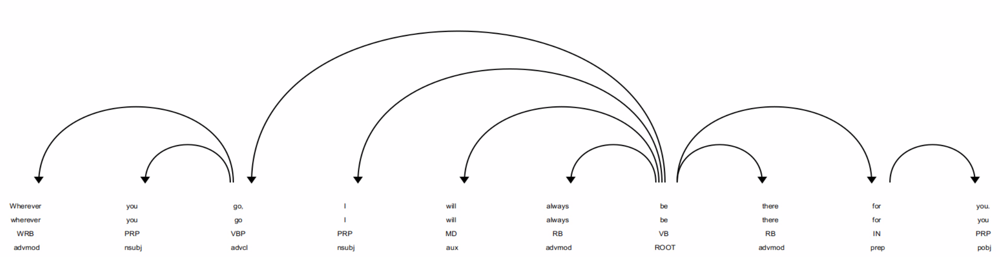
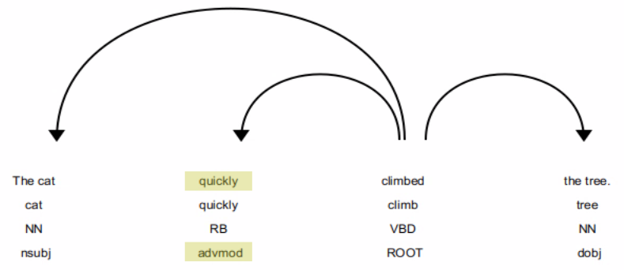

# Adverbials

## Example 1

__Sentence__: "Whatever you do, I will always be there for you."

### Spacy Analysis

| Text         | Index  | POS      | Tag      | Dep      | Dep Detail               | Ancestors            | Children   | Token Head   | Sub Tree     |
| ------ | ------ | ---- | ------- | ------- | --------- |  ------- | ------- | ------- | ------- |
| Whatever     | 0      | PRON     | WDT      | dobj     | direct object            | do be                |            |  do           |  Whatever     |
| you          | 1      | PRON     | PRP      | nsubj    | nominal subject          | do be                |            |  do           |  you          |
| do           | 2      | VERB     | VBP      | advcl    | adverbial clause modifier | be                   | Whatever you |  be           |  Whatever you do |
| ,            | 3      | PUNCT    | ,        | punct    | punctuation              | be                   |            |  be           |  ,            |
| I            | 4      | PRON     | PRP      | nsubj    | nominal subject          | be                   |            |  be           |  I            |
| will         | 5      | AUX      | MD       | aux      | auxiliary                | be                   |            |  be           |  will         |
| always       | 6      | ADV      | RB       | advmod   | adverbial modifier       | be                   |            |  be           |  always       |
| be           | 7      | AUX      | VB       | ROOT     | root                     |                      | do , I will always there for . |  be           |  Whatever you do , I will always be there for you . |
| there        | 8      | ADV      | RB       | advmod   | adverbial modifier       | be                   |            |  be           |  there        |
| for          | 9      | ADP      | IN       | prep     | prepositional modifier   | be                   | you        |  be           |  for you      |
| you          | 10     | PRON     | PRP      | pobj     | object of preposition    | for be               |            |  for          |  you          |
| .            | 11     | PUNCT    | .        | punct    | punctuation              | be                   |            |  be           |  .            |

### Dependency Diagram

## Example 2

__Sentence__: "Wherever you go, I will always be there for you."

### Spacy Analysis

| Text         | Index  | POS      | Tag      | Dep      | Dep Detail               | Ancestors            | Children   | Token Head   | Sub Tree     |
| ------ | ------ | ---- | ------- | ------- | --------- |  ------- | ------- | ------- | ------- |
| Wherever     | 0      | SCONJ    | WRB      | advmod   | adverbial modifier       | go be                |            |  go           |  Wherever     |
| you          | 1      | PRON     | PRP      | nsubj    | nominal subject          | go be                |            |  go           |  you          |
| go           | 2      | VERB     | VBP      | advcl    | adverbial clause modifier | be                   | Wherever you |  be           |  Wherever you go |
| ,            | 3      | PUNCT    | ,        | punct    | punctuation              | be                   |            |  be           |  ,            |
| I            | 4      | PRON     | PRP      | nsubj    | nominal subject          | be                   |            |  be           |  I            |
| will         | 5      | AUX      | MD       | aux      | auxiliary                | be                   |            |  be           |  will         |
| always       | 6      | ADV      | RB       | advmod   | adverbial modifier       | be                   |            |  be           |  always       |
| be           | 7      | AUX      | VB       | ROOT     | root                     |                      | go , I will always there for . |  be           |  Wherever you go , I will always be there for you . |
| there        | 8      | ADV      | RB       | advmod   | adverbial modifier       | be                   |            |  be           |  there        |
| for          | 9      | ADP      | IN       | prep     | prepositional modifier   | be                   | you        |  be           |  for you      |
| you          | 10     | PRON     | PRP      | pobj     | object of preposition    | for be               |            |  for          |  you          |
| .            | 11     | PUNCT    | .        | punct    | punctuation              | be                   |            |  be           |  .            |

### Dependency Diagram

## Example 3

### Spacy Analysis

__Sentence__:The cat __quickly__ climbed the tree.

| Text         | Index  | POS      | Tag      | Dep      | Dep Detail               | Ancestors            | Children   | Token Head   | Sub Tree     |
| ------ | ------ | ---- | ------- | ------- | --------- |  ------- | ------- | ------- | ------- |
| The          | 0      | DET      | DT       | det      | determiner               | cat climbed          |            |  cat          |  The          |
| cat          | 1      | NOUN     | NN       | nsubj    | nominal subject          | climbed              | The        |  climbed      |  The cat      |
| __quickly__      | 2      | ADV      | RB       | __advmod__  | adverbial modifier       | climbed              |            |  climbed      |  quickly      |
| climbed      | 3      | VERB     | VBD      | ROOT     | root                     |                      | cat quickly tree . |  climbed      |  The cat quickly climbed the tree . |
| the          | 4      | DET      | DT       | det      | determiner               | tree climbed         |            |  tree         |  the          |
| tree         | 5      | NOUN     | NN       | dobj     | direct object            | climbed              | the        |  climbed      |  the tree     |
| .            | 6      | PUNCT    | .        | punct    | punctuation              | climbed              |            |  climbed      |  .            |

### Dependency Diagram

## Example 4

The book is __on the shelf__.

### Spacy Analysis

| Text         | Index  | POS      | Tag      | Dep      | Dep Detail               | Ancestors            | Children   | Token Head   | Sub Tree     |
| ------ | ------ | ---- | ------- | ------- | --------- |  ------- | ------- | ------- | ------- |
| The          | 0      | DET      | DT       | det      | determiner               | book is              |            |  book         |  The          |
| book         | 1      | NOUN     | NN       | nsubj    | nominal subject          | is                   | The        |  is           |  The book     |
| is           | 2      | AUX      | VBZ      | ROOT     | root                     |                      | book on .  |  is           |  The book is on the shelf . |
| __on__           | 3      | ADP      | IN       | __prep__    | prepositional modifier   | is                   | shelf      |  is           |  on the shelf |
| the          | 4      | DET      | DT       | det      | determiner               | shelf on is          |            |  shelf        |  the          |
| shelf        | 5      | NOUN     | NN       | pobj     | object of preposition    | on is                | the        |  on           |  the shelf    |
| .            | 6      | PUNCT    | .        | punct    | punctuation              | is                   |            |  is           |  .            |