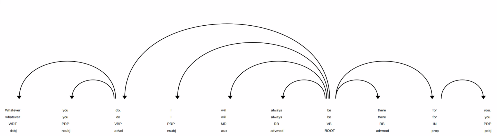

# Adverbials

__Sentence__: "Whatever you do, I will always be there for you."

## Spacy Analysis

| Text         | Index  | POS      | Tag      | Dep      | Dep Detail               | Ancestors            | Children   | Token Head   | Sub Tree     |
| ------ | ------ | ---- | ------- | ------- | --------- |  ------- | ------- | ------- | ------- |
| Whatever     | 0      | PRON     | WDT      | dobj     | direct object            | do be                |            |  do           |  Whatever     |
| you          | 1      | PRON     | PRP      | nsubj    | nominal subject          | do be                |            |  do           |  you          |
| do           | 2      | VERB     | VBP      | advcl    | adverbial clause modifier | be                   | Whatever you |  be           |  Whatever you do |
| ,            | 3      | PUNCT    | ,        | punct    | punctuation              | be                   |            |  be           |  ,            |
| I            | 4      | PRON     | PRP      | nsubj    | nominal subject          | be                   |            |  be           |  I            |
| will         | 5      | AUX      | MD       | aux      | auxiliary                | be                   |            |  be           |  will         |
| always       | 6      | ADV      | RB       | advmod   | adverbial modifier       | be                   |            |  be           |  always       |
| be           | 7      | AUX      | VB       | ROOT     | root                     |                      | do , I will always there for . |  be           |  Whatever you do , I will always be there for you . |
| there        | 8      | ADV      | RB       | advmod   | adverbial modifier       | be                   |            |  be           |  there        |
| for          | 9      | ADP      | IN       | prep     | prepositional modifier   | be                   | you        |  be           |  for you      |
| you          | 10     | PRON     | PRP      | pobj     | object of preposition    | for be               |            |  for          |  you          |
| .            | 11     | PUNCT    | .        | punct    | punctuation              | be                   |            |  be           |  .            |

## Dependency Diagram

