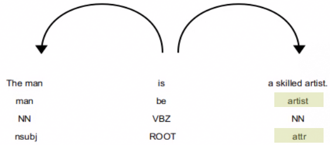
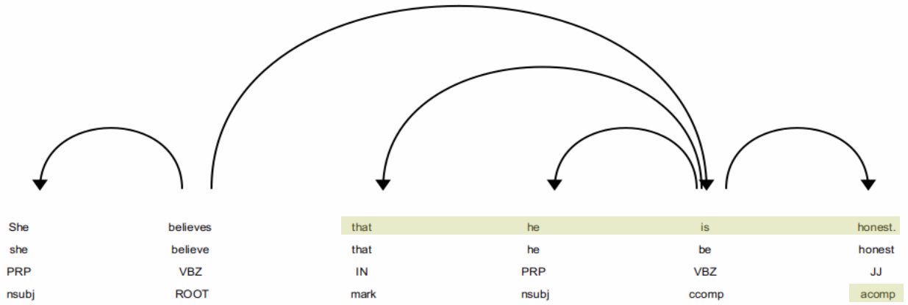
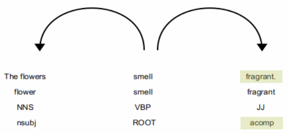

# Complements

## Example 1 - Attributes

The man is a skilled __artist.__

| Text         | Index  | POS      | Tag      | Dep      | Dep Detail               | Ancestors            | Children   | Token Head   | Sub Tree     |
| ------ | ------ | ---- | ------- | ------- | --------- |  ------- | ------- | ------- | ------- |
| The          | 0      | DET      | DT       | det      | determiner               | man is               |            |  man          |  The          |
| man          | 1      | NOUN     | NN       | nsubj    | nominal subject          | is                   | The        |  is           |  The man      |
| is           | 2      | AUX      | VBZ      | ROOT     | root                     |                      | man artist . |  is           |  The man is a skilled artist . |
| a            | 3      | DET      | DT       | det      | determiner               | artist is            |            |  artist       |  a            |
| skilled      | 4      | ADJ      | JJ       | amod     | adjectival modifier      | artist is            |            |  artist       |  skilled      |
| __artist__       | 5      | NOUN     | NN       | __attr__     | attribute                | is                   | a skilled  |  is           |  a skilled artist |
| .            | 6      | PUNCT    | .        | punct    | punctuation              | is                   |            |  is           |  .

### Dependency Diagram

## Example 2 - Clausal Compliments

She believes __that he is honest__.

| Text         | Index  | POS      | Tag      | Dep      | Dep Detail               | Ancestors            | Children   | Token Head   | Sub Tree     |
| ------ | ------ | ---- | ------- | ------- | --------- |  ------- | ------- | ------- | ------- |
| She          | 0      | PRON     | PRP      | nsubj    | nominal subject          | believes             |            |  believes     |  She          |
| believes     | 1      | VERB     | VBZ      | ROOT     | root                     |                      | She is .   |  believes     |  She believes that he is honest . |
| __that__         | 2      | SCONJ    | IN       | mark     | marker                   | is believes          |            |  is           |  that         |
| __he__          | 3      | PRON     | PRP      | nsubj    | nominal subject          | is believes          |            |  is           |  he           |
| __is__          | 4      | AUX      | VBZ      | ccomp    | clausal complement       | believes             | that he honest |  believes     |  that he is honest |
| __honest__      | 5      | ADJ      | JJ       | acomp    | adjectival complement    | is believes          |            |  is           |  honest       |
| .            | 6      | PUNCT    | .        | punct    | punctuation              | believes             |            |  believes     |  .            |

### Dependency Diagram

## Example 3 - Adjectival Complement

The flowers smell __fragrant__.

| Text         | Index  | POS      | Tag      | Dep      | Dep Detail               | Ancestors            | Children   | Token Head   | Sub Tree     |
| ------ | ------ | ---- | ------- | ------- | --------- |  ------- | ------- | ------- | ------- |
| The          | 0      | DET      | DT       | det      | determiner               | flowers smell        |            |  flowers      |  The          |
| flowers      | 1      | NOUN     | NNS      | nsubj    | nominal subject          | smell                | The        |  smell        |  The flowers  |
| smell        | 2      | VERB     | VBP      | ROOT     | root                     |                      | flowers fragrant . |  smell        |  The flowers smell fragrant . |
| __fragrant__     | 3      | ADJ      | JJ       | __acomp__    | __adjectival complement__    | smell                |            |  smell        |  fragrant     |
| .            | 4      | PUNCT    | .        | punct    | punctuation              | smell                |            |  smell        |  .            |

### Dependency Diagram

## Example 4 - Open Clausal Complement

She likes to swim.
| Text         | Index  | POS      | Tag      | Dep      | Dep Detail               | Ancestors            | Children   | Token Head   | Sub Tree     |
| ------ | ------ | ---- | ------- | ------- | --------- |  ------- | ------- | ------- | ------- |
| She          | 0      | PRON     | PRP      | nsubj    | nominal subject          | likes                |            |  likes        |  She          |
| likes        | 1      | VERB     | VBZ      | ROOT     | root                     |                      | She swim . |  likes        |  She likes to swim . |
| __to__           | 2      | PART     | TO       | aux      | auxiliary                | swim likes           |            |  swim         |  to           |
| __swim__         | 3      | VERB     | VB       | __xcomp__    | __open clausal complement__  | likes                | to         |  likes        |  to swim      |
| .            | 4      | PUNCT    | .        | punct    | punctuation              | likes                |            |  likes        |  .            |

### Dependency Diagram

