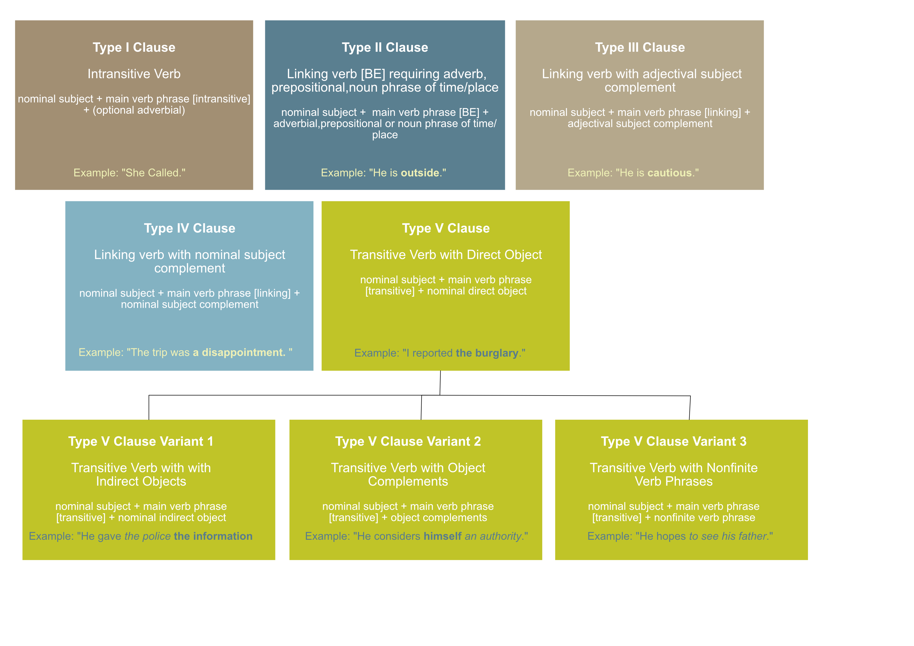
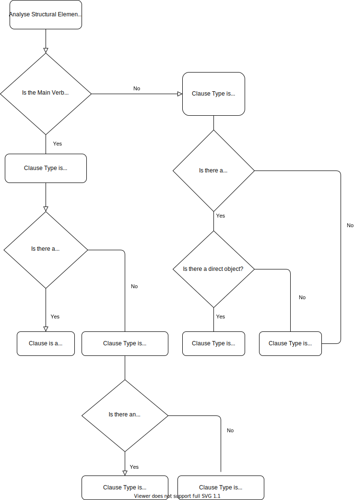

# Main Clause Classification Types



## Type I – Intransitive

There are only two elements required in Clause Type I, a nominal subject and a main verb phrase [intransitive]. Thought it is not required , an adverbial will often serve as a complement for this clause. A intransitive verb does not require a complement to follow it, like a nominal or an adjectival phrase.

```txt
Type I = nominal subject + main verb phrase [intransitive] + (optional adverbial)
```

__Examples__: "She arrived." "He walked."  "She swam."

Sentences are often complicated by sections with adjectival and/or adverbial modifiers. Consider the sentence:

```txt
The skiers arrived before the winter.
```

The highlighted section is an adverbial phrase. The main body of the sentence "The skiers arrived." Could still stand alone as a complete sentence. 

```txt
The materials for the refurbishment finally arrived at the site.
```

The highlighted sections are adjectival and/or adverbial modifiers; however, they are not required. They provide additional details, but they are not essential to the essential meaning of the sentence.

__More Complex Examples__: "I waited for hours last night with this dreadful headache, but eventually gave up and left." "And inded, as you go deeper into the earth, the temperaature increases."

In the first sentence, there are three intransitive verbs: "waited" ,"gave up" and "left". All of these have the same subject "I". The phrase "for hours last night with this dreadful headache" is an optional adverbial phrase. The sentence can exist without it. "I waited, gave up and left"

In the second sentence, there is a single three intransitive verb: "increases". The subject is "the temperature". The phrase "as you go deeper into the earth" is an optional adverbial phrase. Again, the sentence can exist without it. "The temperature increases."

## Type II – Linking verb BE requiring adverb of time/place

There are three elements required in Clause Type II, a nominal subject, a main verb phrase [BE], and an adverbial of time or place. BE in this context is the linking verb "to be", for example: am, is, are, was, were.

The [BE] type linking verbs found in Type II clauses require a complement to complete the clause. In the case of Type II clauses, a BE linking verb is required, along with a adverbial complement. This adverbial complement completes the predicate and indicates time or place for the main action.

```txt
Type II = nominal subject + main verb phrase [BE] + adverbial/prepositional/noun phrases of time/place
```

__Examples__: "She is at the park." "He is outside." "They are far away" "John is here."

The required phrase to complete the predicate can be:

- An adverbial phrase of place or time (later, here)
- A prepositional phrase of place or time (at the village, in the car)
- A noun phrase of place or time (tomorrow, next year)

If there is more than one adverbial phrase that follows the linking BE verb, one of the phrases will be considered the complement while the other will be an optional adverbial modifier (which can be omitted):

__Examples__: "The army will be __at the walls__ by the weekend."

In this example "at the walls" is required, but "by the weekend" is not.

## Type III – Linking verb with adjectival subject complement

There are three elements required in Clause Type III, a nominal subject, a main verb phrase [linking], and an adjectival subject complement.

```txt
Type III = nominal subject + main verb phrase [linking] + adjectival subject complement
```

In the type III of clause an adjectival subject complement follows the linking verb and modifies or describes the subject.

__Examples__: "The policemen were __cautious__ in their investigation."  "He looks __as if he could go on forever__." "They are __in fine form__."

The first example above uses a simple __adjective__, the second example uses __an adjectival clause__ and the third example uses an __adjectival phrase__.

A useful method to determine if the clause is acting adjectivally is to replace the entire clause with a single adjective. Applying this to our examples we get:

__Examples__: "The policemen were __cautious__ in their investigation."  "He looks __relentless__." "They are __happy__."

## Type IV – Linking verb with nominal subject complement

There are three elements required in Clause Type IV, a nominal subject, a main verb phrase [linking], and a nominal subject complement (nominal that renames the nominal subject). In the Type IV clause the subject complement is always a nominal or something that is acting as a nominal. The nominal subject complement always refers to the same person or thing as the subject. In this clause type the subject complement is mandatory; in its absence the sentence loses its meaning.

```txt
Type IV = nominal subject + main verb phrase [linking] + nominal subject complement
```

Type IV clauses are a common type of clause in English. They are used to express a variety of meanings, such as:

- Describing the state or condition of a subject
- Renaming a subject
- Expressing attributes of a subject
- Highlighting the quality or quantity of a subject


### A Note on Linking Verbs

Linking verbs, also known as copula verbs, are verbs that connect the subject of a sentence to a subject complement, which can be a noun, pronoun, or adjective. Unlike action verbs, linking verbs don't show an action; instead, they express a state of being, a condition, or a relationship. Linking verbs help to describe or identify the subject.

In sentences with linking verbs, the subject complement (the word or phrase that follows the linking verb) provides additional information about the subject. It describes a quality, condition, or identity of the subject rather than showing an action. The subject and the subject complement are synonymous.


__Common linking verbs include:__

- Forms of "to be": am, is, are, was, were, be, being, been.  Example: "She is a teacher."
- Sensory verbs: feel, look, sound, taste, smell. Example: "The flowers smell wonderful."
- Other verbs: become, seem, appear, remain, grow, turn, prove. Example: "The situation became complicated."

__Examples of Type IV Clauses__: "The trip was a disappointment."  "The day was to end in tragedy." "The result seemed a success." 

In examples (1) through (3), the linking verb is followed by a nominal, which serves to rename the subject.

In the first example the "trip" and its complement "disappointment" refer to the same event.

In example two the complement "to end in tragedy." reframes the subject "The day". 

In the third example the "result" and its complement "success" refer to the same thing.

## Type V – Transitive with Direct Object

There are three elements required in Clause Type V, a nominal subject, a main verb phrase [transitive], and a direct object (nominal that is different from the nominal subject). Transitive verbs - unlike intransitive verbs - require a direct object - or a second nominal that completes the action of the verb. The nominal complement (the direct object) in a Type V clause __does not__ refer back to the subject. We can think of the direct object as answering the what or whom of the action.

```txt
Type V = nominal subject + main verb phrase [transitive] + nominal direct object
```

__Examples of Type V Clauses__: "I reported the burglary."  "She emptied her purse." "She helped the old lady cross the road." "She speaks French" "She ate an apple"

We can think of the direct object as answering the "what" or "whom" of the action.

```txt
"I reported what?" "I reported the burglary."
"She emptied what?." "She emptied her purse."
"She helped whom?" "She helped the old lady cross the road."
"She speaks what?" "She speaks French"
"She ate what?" "She ate an apple"
```

Type V has a transitive Main Verb, while Type IV has a BE/linking Main Verb. These are easily confused as the nominal complement also answers what or whom; however, the nominal complement (the direct object—in a Type V clause) does not refer back to the subject.


### Type V Variation with Indirect Objects

We may also find a Type V clause with three nominals that do not refer to the same subject. In these cases, we have the subject, the direct object, and an indirect object—the recipient of the direct object:

__Examples of Type V Variation Clauses__: "He gave the police __the information__"  "She told her husband __the truth__" "The doctor gave himself __a clean bill of health__."

The direct object has been outlined in bold in the examples above.

We can typically determine the indirect object by asking “to whom”. The indirect object will typically immediately precede the direct object. If we have two nominals in a row following a transitive verb, we can suspect that one of these is an indirect object.

### Type V Variation with Object Complements

We may also find a Type V variant clause with object complements.

__Examples of Type V Variation Clauses with Object Complements__: "He considers __himself__ _an authority_."  "It made __life__ _difficult_."


The direct object has been outlined in bold and the object complement in italics in the examples above.

It can be difficult to distinguish between a direct object,indirect object and object complement. We can normally clarify the situation by asking. 

- Is there an action that can be received?
- Can we identify “who” is receiving the action?
  
If the answer to both these questions is no then we are dealing with an object complement.

For the second sentence:

```txt
"It made life difficult."
```

 We can see that "difficult" is an adjective that modifies "life". Thus, we can determine that "difficult" acts in the capacity of an object complement.


### Type V Variation with Nonfinite Verb Phrases

We may also find a Type V variant clause with nonfiinite verb phrases.

__Examples of Type V Variation Clauses with Nonfinite Verb Phrases__: "He hopes __to see his father__."  "She wants __to be a mother__."


The non-finite verb phrase has been outlined in bold in the examples above.

Again, it can be difficult to distinguish between a direct object,indirect object,object complement and a non-fiinite verb phrase. We can normally clarify the situation by substituting the phrase with __something__. If we can replace the phrase with "__something__" then we can assume that the phrase is acting as a nominal.

For the first sentence:

```txt
"He hopes something."  "He hopes to see his father."
```

In addition to these main clause types, there are two "other", primarily independent, clauses: interrogatives and imperatives.

### Imperative Clause

An imperative clause is a type of clause in grammar that is used to give a command or make a request. It typically contains a verb in the base form (infinitive) and is often understood to have an implicit subject, which is usually the second person pronoun "you." Imperative clauses are commonly used to express direct instructions, orders, suggestions, or advice.

__Examples of Imperative Clauses__: "Close the door."  "Please pass me the salt." "Be quiet."  "Don't forget to bring your umbrella."

### Interrogative clauses

Interrogative clauses, also known as interrogative sentences or questions, are structures in grammar used to seek information or elicit a response. Interrogative clauses typically begin with a question word (such as who, what, where, when, why, or how) or an auxiliary verb (helping verb), and they often have a different word order than declarative sentences.

There are two main types of interrogative clauses:

__Yes/No Questions__: These questions can be answered with "yes" or "no." They often begin with an auxiliary verb or the verb "to be."

__Examples of Yes/No Clauses__: "Are you coming to the party?" "Did she finish her homework?" "Is it raining outside?"


__Wh-Questions__: These questions seek specific information and begin with question words like who, what, where, when, why, or how.

__Examples of Wh-Question Clauses__: "What is your name?"  "Where did you go yesterday?" "How do you solve this problem?"


